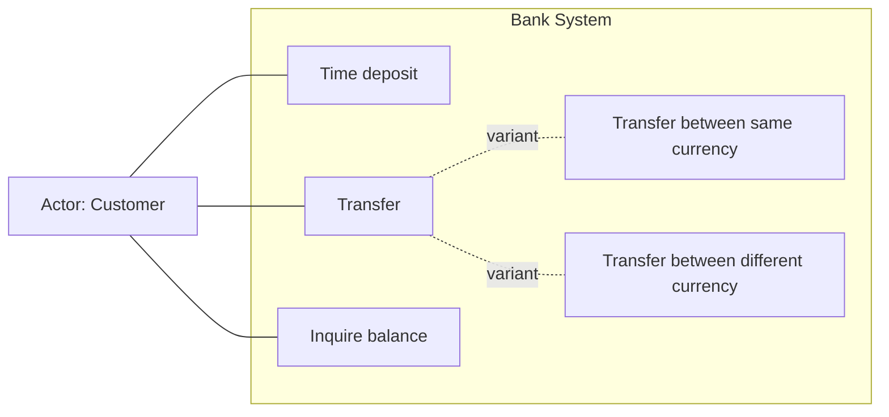
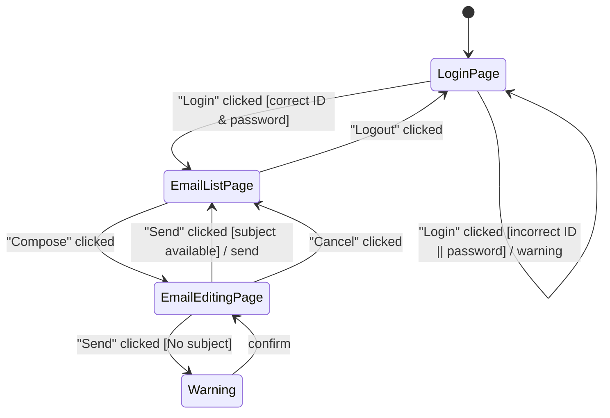
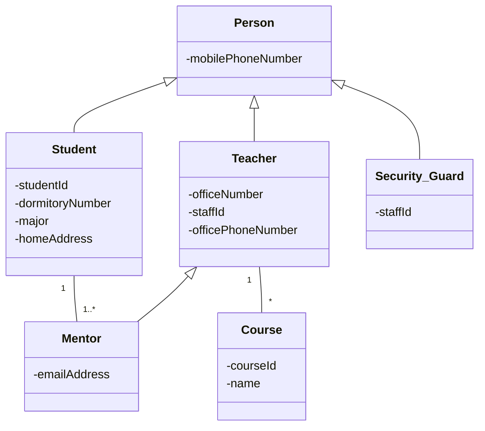
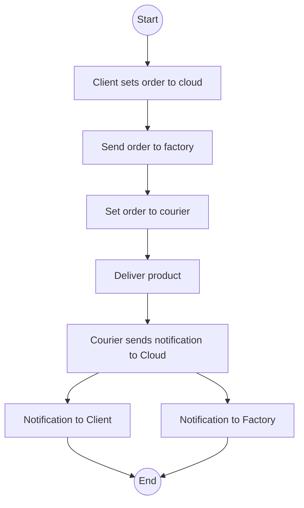
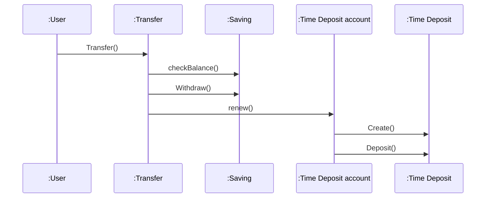
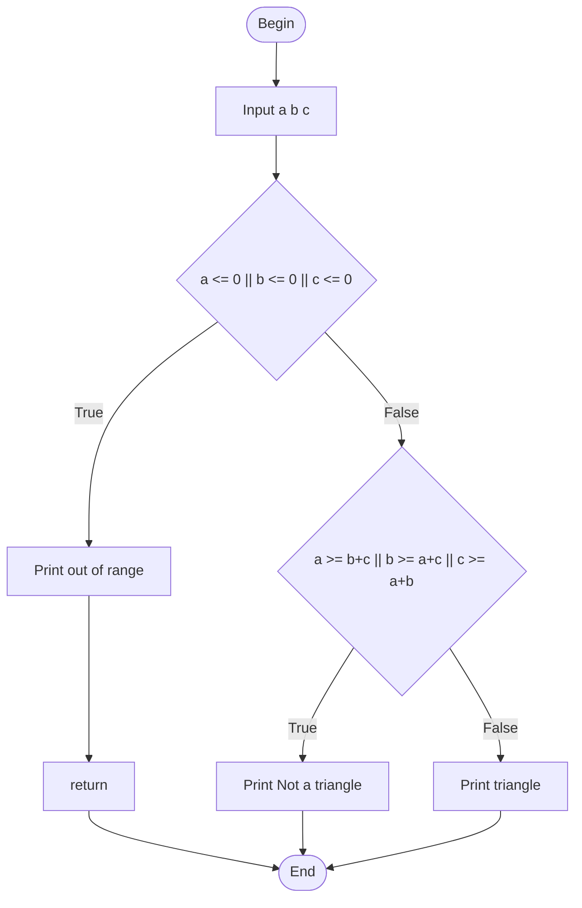

---
tags:
  - course/se
  - se/class-exercise
  - exam/drawing
---

# 04 Class Exercise Templates

Source: class exercise PPTX files in `D:\study\se`.

Use this page as the "exam drawing muscle memory" page.

## Lecture 3 Requirements Table

Source: [Lecture 3 class exercise table.pptx](<file:///D:/study/se/Lecture%203%20class%20exercise%20table.pptx>)

What it trains:

- Translate vague requirements into measurable values.
- Notice undefined values and incomplete specifications.
- Use weights/priorities when comparing alternatives.

Exam pattern:

1. Read the requirement statement.
2. Identify measurable attributes.
3. Mark undefined or missing information.
4. Apply weight or priority if the table provides one.

Trap:

- Do not invent values when the requirement is undefined. In requirements engineering, "undefined" is itself a problem.

## Lecture 4 Use Case Diagram: Bank Transfer

Source: [class exercise lecture 4 use case diagram.pptx](<file:///D:/study/se/class%20exercise%20lecture%204%20use%20case%20diagram.pptx>)

Given concepts:

- Actor: Customer
- Use cases: Time deposit, Transfer, Inquire balance
- Variants: Transfer between same currency, Transfer between different currency

Preferred thinking:

- Start with the simple version first: Customer connected to Time deposit, Transfer, Inquire balance.
- Add include/extend only when the question clearly requires mandatory reuse or optional conditional behavior.

Mermaid memory sketch:

Exam warning:

- The PPT asks you to compare "no include/extend", "extend", and "include" versions. This means the exam may test when a relationship is justified, not just whether you can draw arrows.
- For the exact judgment rules, see [[10 Include vs Extend]].
- For all use case relationship symbols, see [[11 Use Case Diagram Relationships]].

## Lecture 4 State Transition Diagram: Email System

Source: [class exercise lecture 4 state transition diagram.pptx](<file:///D:/study/se/class%20exercise%20lecture%204%20state%20transition%20diagram.pptx>)

States:

- Login Page
- Email list page
- Email editing page
- Warning, only if the warning window has two or more buttons

Events/guards/actions:

- `"Login" clicked [correct ID & password]`
- `"Login" clicked [incorrect ID || password] / warning`
- `"Compose" clicked`
- `"Send" clicked [No subject]`
- `"Send" clicked [subject available] / send`
- `"Cancel" clicked`
- `"Logout" clicked`

Mermaid memory sketch:

Teacher rule from PPT:

- If a window has two or more buttons, it can be treated as a state.
- If it has only one button, treat it as an action instead of a state.
- Confirm details with users when drawing real diagrams.

## Lecture 5 Class Diagram: Person Hierarchy

Source: [Class exercise lecture 5 Class.pptx](<file:///D:/study/se/Class%20exercise%20lecture%205%20Class.pptx>)

Observed structure from PPT image:

- `Person`
  - attribute: `mobilePhoneNumber`
- `Student` extends `Person`
  - attributes: `studentId`, `dormitoryNumber`, `major`, `homeAddress`
- `Teacher` extends `Person`
  - attributes: `officeNumber`, `staffId`, `officePhoneNumber`
- `Security_Guard` extends `Person`
  - attribute: `staffId`
- `Mentor`
  - attribute: `emailAddress`
- `Course`
  - attributes: `courseId`, `name`

Relationships:

- `Student` to `Mentor`: one student has `1..*` mentors? The diagram shows multiplicity `1..*` near Student and `1` near Mentor; review the PPT if exact side matters.
- `Mentor` generalizes to/relates upward with `Teacher`.
- `Teacher` to `Course`: one teacher teaches many courses, or each course has one teacher depending on multiplicity placement.

Mermaid memory sketch:

Exam warning:

- Inheritance uses a hollow triangle arrow pointing to the superclass.
- Multiplicity placement matters. Re-check which side owns `1` and which side owns `*`.

## Lecture 6 Class Diagram: Bank Accounts

Source: [class exercise lecture 6 class diagram.pptx](<file:///D:/study/se/class%20exercise%20lecture%206%20class%20diagram.pptx>)

Extracted classes:

- Saving Account: `account no`, `balance`
- Deposit Account
- Investment Account
- Deposit: `startDate`, `maturityDate`, `amount`, `interestRate`
- Investment: `type`, `unit`, `price`, `amount`
- Customer: `Name`, `homeAddress`, `phoneNumber`
- Transfer: `date`, `amount`

Likely relationships:

- A `Customer` owns one or more accounts.
- `Deposit Account` and `Investment Account` are special account types.
- `Transfer` links accounts and records date/amount.

Exam use:

1. Identify candidate classes from nouns.
2. Put stable data into attributes.
3. Use inheritance only for true account subtypes.
4. Use association classes like `Transfer` when a relationship has its own attributes.

## Lecture 6 Activity Diagram: Order Delivery

Source: [class exercise lecture 6 activity diagram.pptx](<file:///D:/study/se/class%20exercise%20lecture%206%20activity%20diagram.pptx>)

Flow:

1. Client sets order to cloud.
2. Cloud sends order to factory.
3. Cloud sets order to courier.
4. Courier delivers product.
5. Courier sends notification to Cloud.
6. Cloud sends notification to Client.
7. Cloud sends notification to Factory.

Mermaid memory sketch:

Exam warning:

- Use swimlanes if the problem asks responsibility by Client/Cloud/Factory/Courier.

## Lecture 6 Sequence Diagram: Transfer

Source: [class exercise lecture 6 sequence diagram.pptx](<file:///D:/study/se/class%20exercise%20lecture%206%20sequence%20diagram.pptx>)

Objects/messages from PPT:

- `:User`
- `:Transfer`
- `:Saving`
- `:Time Deposit account`
- `:Time Deposit`
- messages: `Transfer()`, `Withdraw()`, `renew()`, `checkBalance()`, `Create()`, `Deposit()`

Exam pattern:

1. Actor initiates the transaction.
2. Boundary/control object receives request.
3. Account objects perform checks and updates.
4. Create or update deposit object if the transfer creates a deposit.

Mermaid memory sketch:

## Lecture 11 Restructuring/Class Exercise

Source: [class exercise lecture 11 restructuring (2).pptx](<file:///D:/study/se/class%20exercise%20lecture%2011%20restructuring%20%282%29.pptx>)

Extracted classes/attributes/operations:

- Teacher: `Name`, `Credit`, `Office number`, `Card ID`, `Update()`, `ShowSyllabus()`
- Student: `Mobile number`, `ID`, `Update()`
- Course: `Course name`
- Member: `Name`, `Update()`

Likely refactoring idea:

- `Teacher` and `Student` share common member-like data/operation.
- Move common `Name` and `Update()` into `Member`.
- Keep role-specific data in subclasses.

Exam pattern:

1. Find duplicated attributes/operations.
2. Extract superclass or shared abstraction.
3. Keep subtype-specific responsibilities in subclasses.
4. Check multiplicities after restructuring.

## Lecture 13 Triangle Testing

Source: [Class exercise Lecture 13 (1).pptx](<file:///D:/study/se/Class%20exercise%20Lecture%2013%20%281%29.pptx>)

Problem:

- Inputs: `a`, `b`, `c`
- Invalid input: `a <= 0 || b <= 0 || c <= 0`
- Not triangle: one side is greater than or equal to the sum of the other two.
- Triangle: all sides positive and triangle inequality holds.

Control-flow memory sketch:

Weak equivalence classes:

- Invalid input.
- Valid input but not a triangle.
- Valid triangle.

Strong equivalence classes include combinations:

- Three inputs `<= 0`.
- Exactly one input `<= 0`.
- Exactly two inputs `<= 0`.
- Triangle inequality fails by each side.
- Triangle inequality holds.

Boundary idea:

- For triangle inequality, test equality and just beyond equality, e.g. `(2, 3, 5)` and `(2, 3, 6)`.

White-box minimum from PPT:

- Statement testing: 3 cases.
- Branch testing: 3 cases.
- Path testing: 3 cases.
- Cases: `(-1, -2, 3)`, `(1, 2, 3)`, `(4, 5, 6)`.
