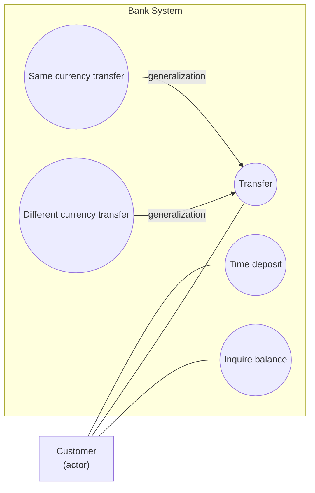
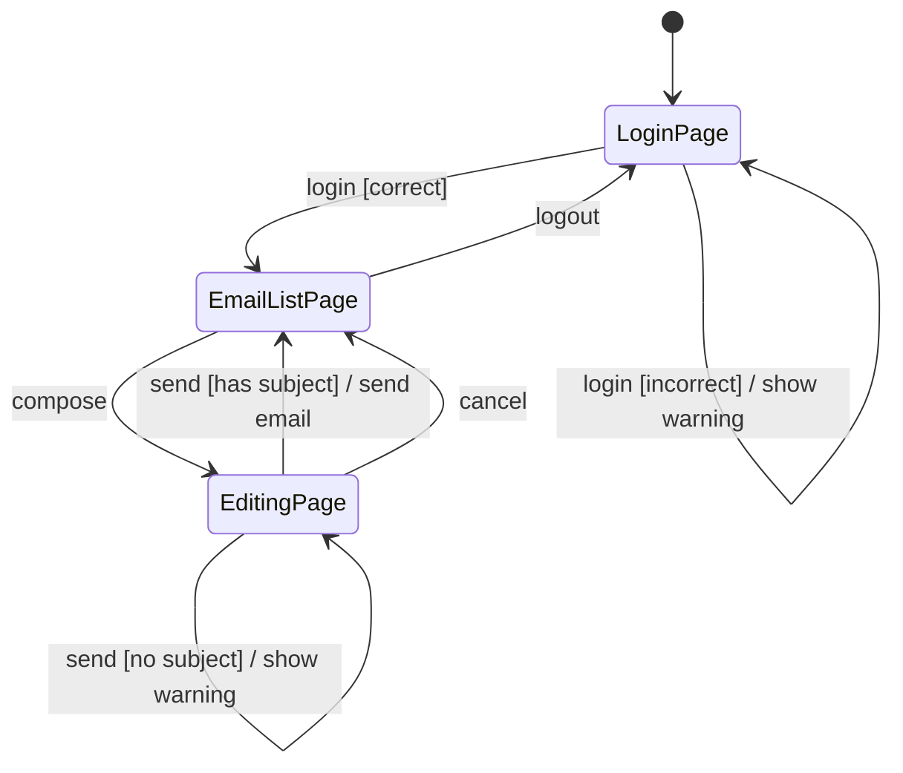
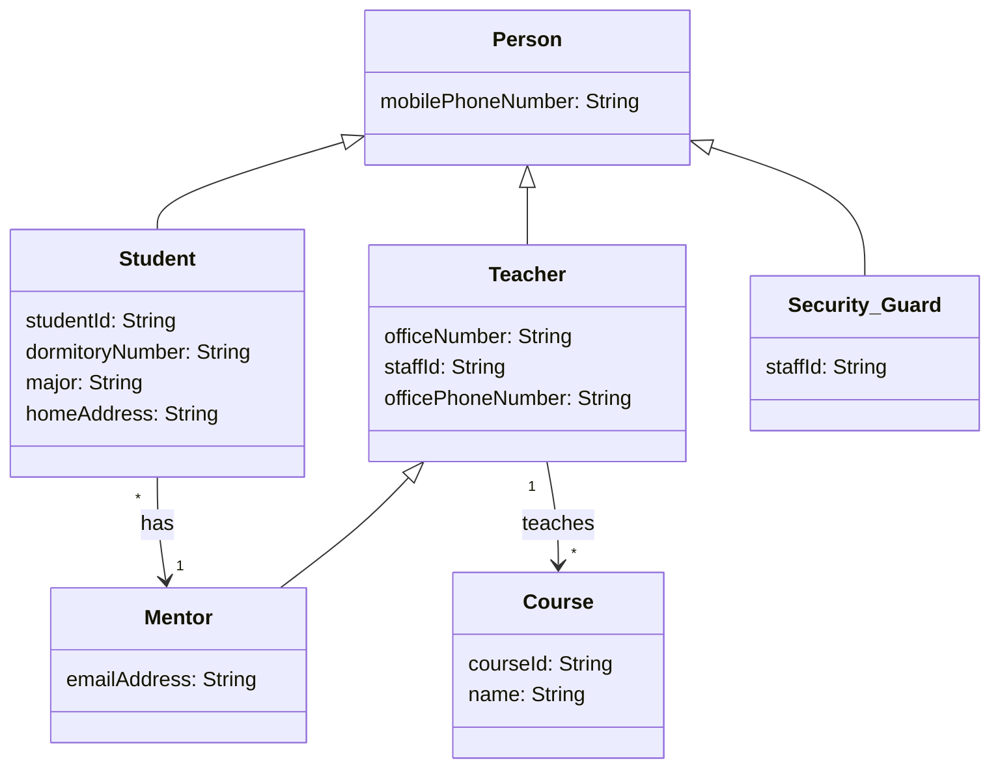
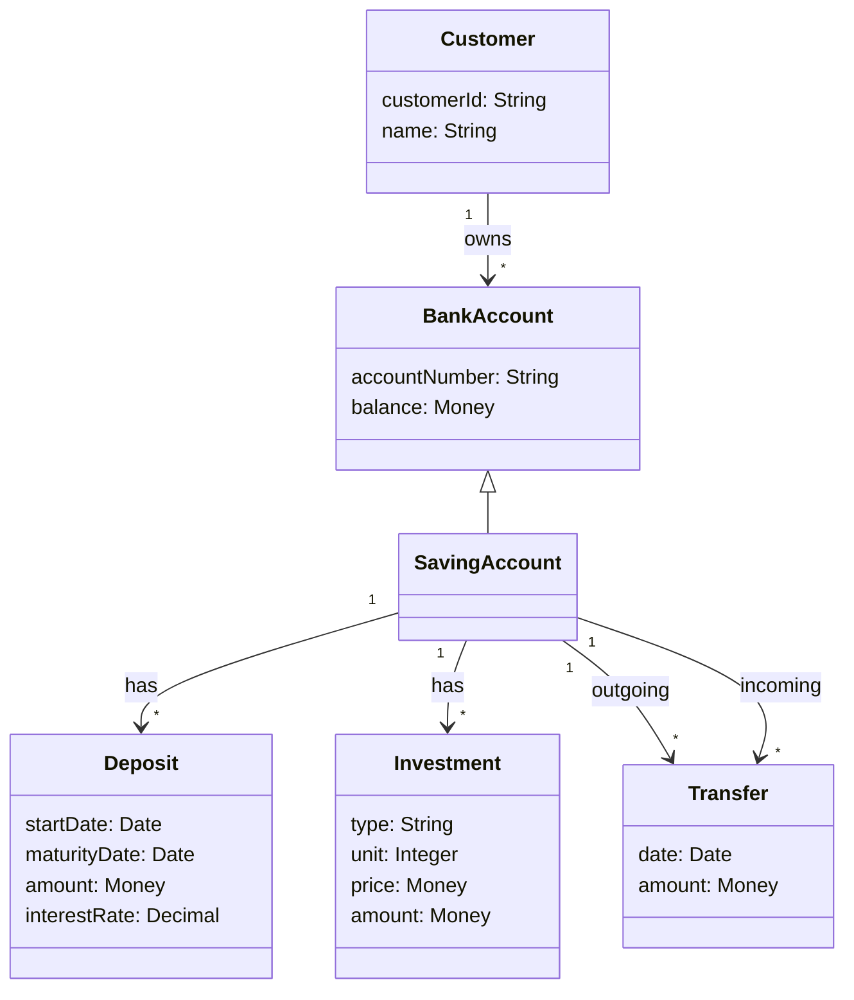
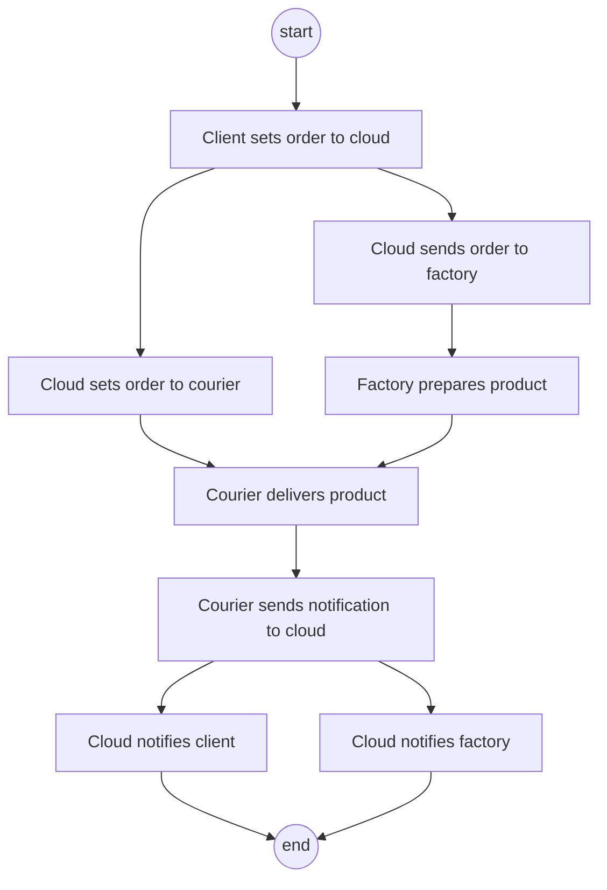
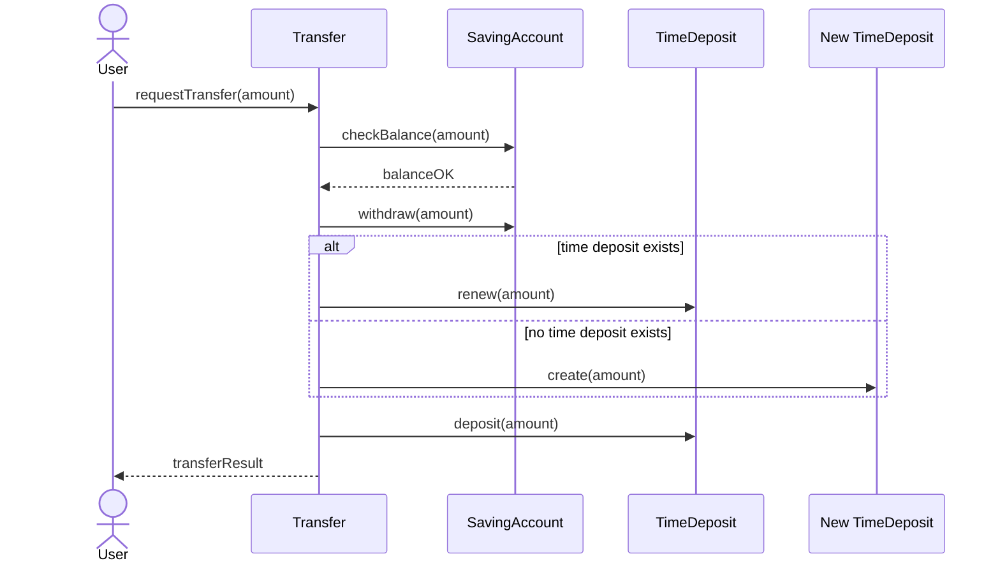
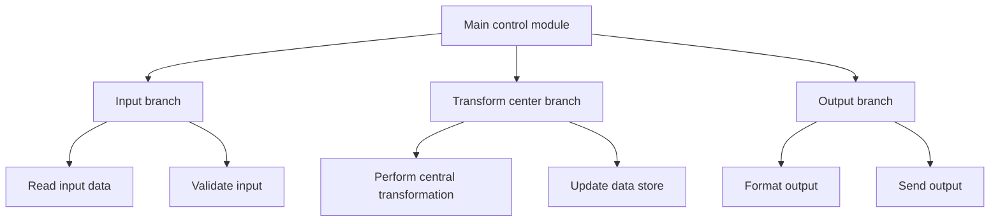
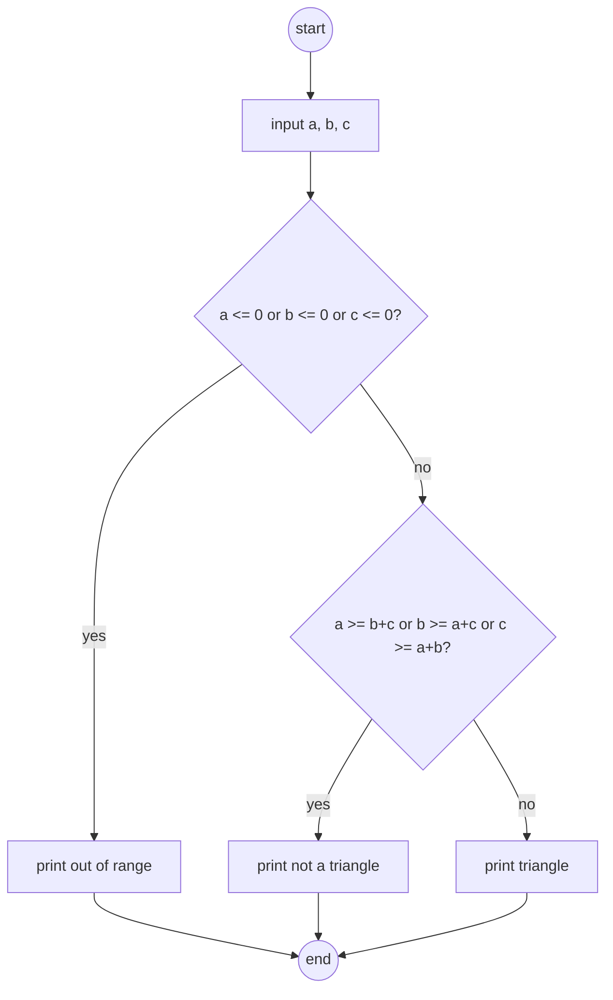
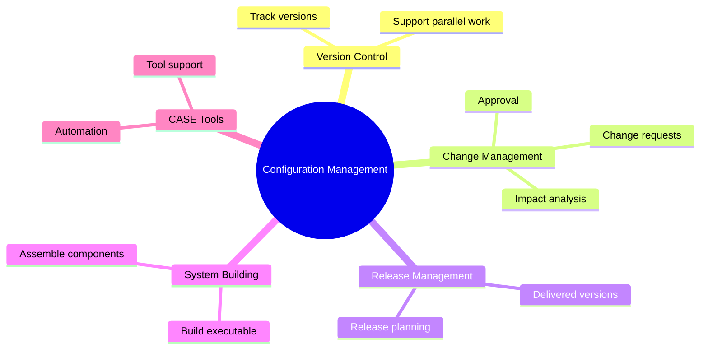

---
tags:
  - course/se
  - exam/drawing
  - se/drill
---

# Drawing Drill Pack

Use this as active recall. Draw first, then check [04 Class Exercise Templates](./04%20Class%20Exercise%20Templates.md).

## Drill Rules

1. Set a timer for 6-8 minutes per diagram.
2. Draw without looking at notes.
3. Compare with the checklist.
4. Mark the first mistake, not every mistake.
5. Redraw the same type once more after 20 minutes.
6. Keep answers at the end of the drill note, not directly under the prompt.
7. Use Mermaid for diagram answers so they can be reviewed in Obsidian and GitHub.

## Drill 1: Bank Use Case Diagram

Prompt:

A bank customer can make a time deposit, transfer money, and inquire balance. Transfer may be between the same currency or different currencies.

Must include:

- Actor: Customer.
- System boundary: Bank System.
- Use cases: Time deposit, Transfer, Inquire balance.
- Transfer variants: same currency, different currency.

Self-check:

- [ ] Actor outside boundary.
- [ ] Use cases inside boundary.
- [ ] No random UI details.
- [ ] Include/extend only if justified.

English sentence to remember:

Use case diagrams describe user-visible goals between actors and the system.

## Drill 2: Email State Transition Diagram

Prompt:

An email system starts at a login page. Correct login goes to email list page; incorrect login shows a warning. From the list page, compose opens an email editing page. In editing, send without subject warns the user; send with subject sends the email; cancel returns to list. Logout returns to login.

Self-check:

- [ ] Stable states are pages/windows.
- [ ] Events label arrows.
- [ ] Guards use `[condition]`.
- [ ] Actions use `/action`.
- [ ] One-button warning can be treated as action.

English sentence:

A state transition diagram models event-driven changes between system states.

## Drill 3: Person Class Diagram

Prompt:

Model Person, Student, Teacher, Security_Guard, Mentor, and Course. Person has mobilePhoneNumber. Student has studentId, dormitoryNumber, major, homeAddress. Teacher has officeNumber, staffId, officePhoneNumber. Security_Guard has staffId. Mentor has emailAddress. Course has courseId and name. Student, Teacher, Security_Guard are types of Person; Mentor is a type of Teacher. Teacher teaches Course. Student has Mentor.

Self-check:

- [ ] Attributes are inside class boxes.
- [ ] Hollow triangle points to superclass.
- [ ] Multiplicity appears on associations.
- [ ] No inheritance unless "is-a" is true.

English sentence:

A class diagram shows static structure: classes, attributes, operations, relationships, and multiplicities.

## Drill 4: Bank Account Class Diagram

Prompt:

Model a customer who owns bank accounts. Saving Account has account number and balance. Deposit has start date, maturity date, amount, and interest rate. Investment has type, unit, price, and amount. Transfer has date and amount.

Self-check:

- [ ] Customer and account classes are separated.
- [ ] Transfer is modeled as an association/object if it has attributes.
- [ ] Deposit/Investment data are not forced into Customer.
- [ ] Multiplicity is reasonable.

English sentence:

If a relationship has attributes, consider making it an association class or separate class.

## Drill 5: Order Activity Diagram

Prompt:

Client sets an order to cloud. Cloud sends the order to factory and sets the order to courier. Courier delivers product and sends notification to cloud. Cloud notifies client and factory.

Self-check:

- [ ] Actions are verb phrases.
- [ ] Flow order is clear.
- [ ] Parallel notification is shown if useful.
- [ ] Swimlanes are added if responsibility is required.

English sentence:

An activity diagram describes workflow and control flow.

## Drill 6: Transfer Sequence Diagram

Prompt:

A user requests a transfer. The transfer object checks balance in a saving account, withdraws money, renews or creates a time deposit account, and deposits into a time deposit.

Self-check:

- [ ] Lifelines are objects/actors.
- [ ] Time flows downward.
- [ ] Messages are operations.
- [ ] Object creation/update is shown when relevant.

English sentence:

A sequence diagram shows object interactions ordered by time.

## Drill 7: Structured Design From DFD

Prompt:

Given a DFD with input processes, a central transform process, and output processes, convert it into a structured tree.

Self-check:

- [ ] Top module controls the system.
- [ ] First-level branches: input, transform, output.
- [ ] Second-level modules follow DFD processes.
- [ ] Restructuring improves cohesion and reduces coupling.

English sentence:

Structured design converts data-flow models into a module hierarchy.

## Drill 8: Triangle Testing

Prompt:

Inputs are `a`, `b`, `c`. If any input is `<= 0`, print out of range and return. Else if any side is `>=` the sum of the other two, print not a triangle. Otherwise print triangle.

Draw:

- Control-flow chart.
- Equivalence classes.
- Minimum test cases for statement/branch/path testing.

Self-check:

- [ ] Invalid input branch exists.
- [ ] Not-triangle branch exists.
- [ ] Valid triangle branch exists.
- [ ] Test cases cover all three outputs.
- [ ] Boundary equality such as `(2, 3, 5)` is handled.

English sentence:

Equivalence-class testing partitions inputs; boundary value testing checks values at and around boundaries.

## Drill 9: Configuration Management Concept Map

Prompt:

Draw a small concept map linking configuration management to version control, change management, release management, system building, and CASE tools.

Self-check:

- [ ] Version control is only one activity.
- [ ] Change management handles requested changes.
- [ ] Release management handles delivered versions.
- [ ] System building assembles components into executables.

English sentence:

Configuration management manages an evolving software system through standards and procedures.

## Drill 10: Cost Estimation Comparison Table

Prompt:

Make a table comparing LOC, function points, object points, COCOMO II, productivity, person-month, and price to win.

Self-check:

- [ ] LOC is language-dependent.
- [ ] Function points are functionality-based.
- [ ] Object points are screen/report/component-based.
- [ ] COCOMO II is algorithmic.
- [ ] Price to win is market/contract based, not true engineering cost.

English sentence:

Cost estimation predicts effort, time, and cost before or during development.

---

## Answer Key

Use this section only after attempting the drills.

### Answer 1: Bank Use Case Diagram



Key answer:
- `Customer` is outside the system boundary.
- The three user-visible goals are inside `Bank System`.
- Same-currency and different-currency transfers are special types of `Transfer`, so they are modeled with generalization, not include.

### Answer 2: Email State Transition Diagram



Key answer:
- Pages/windows are stable states.
- Login warning and no-subject warning can be modeled as actions on transitions.
- Guards such as `[correct]` and `[no subject]` decide which transition fires.

### Answer 3: Person Class Diagram



Key answer:
- Hollow triangle points to the superclass in UML; Mermaid uses `<|--`.
- `Mentor` is a type of `Teacher`, not just associated with Teacher.
- Multiplicity can be adjusted if the question gives stricter rules, but a reasonable default is many students can have one mentor.

### Answer 4: Bank Account Class Diagram



Key answer:
- `Transfer` has its own attributes, so it should be modeled as a class or association class.
- `Deposit` and `Investment` belong to account-related structure, not directly to `Customer`.
- If the exam states source and target accounts explicitly, add role names such as `fromAccount` and `toAccount`.

### Answer 5: Order Activity Diagram



Key answer:
- Use activity/action labels, not class names only.
- Parallel branches are acceptable when cloud notifies factory and courier independently.
- Swimlanes can be added if the question explicitly asks for responsibility partitions.

### Answer 6: Transfer Sequence Diagram



Key answer:
- Sequence diagrams show object communication ordered by time.
- `checkBalance`, `withdraw`, `renew/create`, and `deposit` are messages.
- Creation can be shown with a `create()` message.

### Answer 7: Structured Design From DFD



Key answer:
- First-level factoring normally separates input, transform, and output branches.
- Second-level modules follow the processes in the DFD.
- Restructuring should reduce coupling and increase cohesion.

### Answer 8: Triangle Testing

Control-flow chart:



Equivalence classes:

| Class | Example | Expected output |
|---|---|---|
| input out of range | `(-1, -2, 3)` | out of range |
| not a triangle | `(1, 2, 3)` | not a triangle |
| valid triangle | `(4, 5, 6)` | triangle |

Minimum useful test cases:

| Purpose | Test case | Expected output |
|---|---|---|
| invalid input branch | `(-1, -2, 3)` | out of range |
| triangle inequality equality boundary | `(1, 2, 3)` | not a triangle |
| valid triangle branch | `(4, 5, 6)` | triangle |

### Answer 9: Configuration Management Concept Map



Key answer:
- Version control is part of configuration management, not the whole thing.
- Change management controls proposed changes.
- Release management controls what version is delivered.
- System building turns components into a runnable system.

### Answer 10: Cost Estimation Comparison Table

| Method / term | Core idea | Strength | Trap |
|---|---|---|---|
| LOC / KLOC | estimate by lines of code | simple after language is known | language-dependent |
| Function Points | estimate by system functionality | earlier than LOC, user-oriented | needs weighting/counting rules |
| Object Points | screens, reports, components | useful for application composition | not UML object count |
| COCOMO II | algorithmic effort model | structured cost model | needs correct submodel and parameters |
| Productivity | output / effort | compares efficiency | depends on measurement type |
| Person-month | one person working one month | effort unit | not equal to calendar month |
| Price to win | bid price based on market/contract | useful for winning contract | not true engineering cost |

Exam wording:

```text
Cost estimation predicts the effort, time, and cost required to develop a software system. Different metrics are useful at different stages: LOC is code-based, function points are functionality-based, object points are screen/report/component-based, and COCOMO II is an algorithmic cost model.
```
