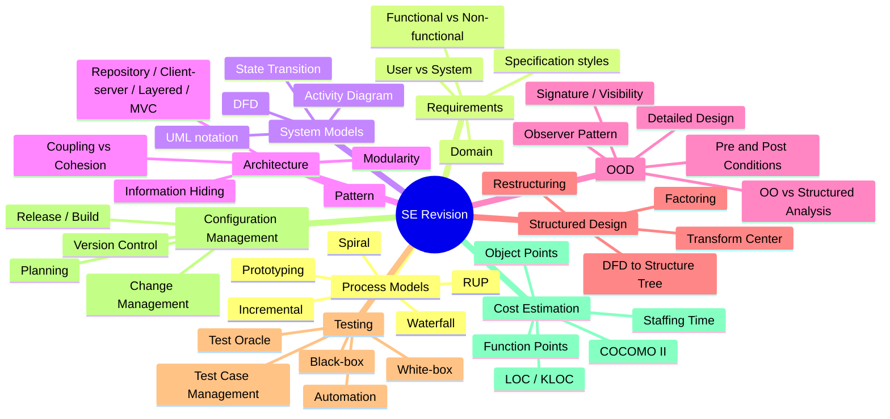

---
tags:
  - course/se
  - se/my-notes
  - exam/review
  - exam/mcq
  - exam/drawing
  - se/process-model
  - se/requirements
  - se/architecture
  - se/testing
  - se/cost-estimation
---

# Software Engineering 复习资料：从 Process Models 到 Cost Estimation

## 笔记说明

This note is a Software Engineering exam revision map from **Software Process Models** to **Cost Estimation**.

- Purpose: connect core definitions, model comparisons, diagram ideas, testing concepts, configuration management, and cost estimation formulas.
- Exam use: focus on English terms, MCQ boundaries, when-to-use distinctions, diagram recognition, and calculation/template recall.
- Images: copied into local `assets/` for this note and embedded with simple relative Markdown paths.

---

## 思维导图



---

## 思维导图节点定位

- **SE Revision**
  - [[SE Revision From Models to Cost Estimation#目录|目录]]
  - [[SE Revision From Models to Cost Estimation#15. 快速复习表|快速复习表]]
- **Process Models**
  - [[SE Revision From Models to Cost Estimation#1. Lecture 2 - Software Process Models|Process Models]]
  - [[SE Revision From Models to Cost Estimation#1.2 Waterfall Model 瀑布模型|Waterfall]]
  - [[SE Revision From Models to Cost Estimation#1.3 Incremental Model 增量模型|Incremental]]
  - [[SE Revision From Models to Cost Estimation#1.4 Prototyping Model 原型模型|Prototyping]]
  - [[SE Revision From Models to Cost Estimation#1.5 Spiral Model 螺旋模型|Spiral]]
  - [[SE Revision From Models to Cost Estimation#1.6 RUP - Rational Unified Process|RUP]]
- **Requirements**
  - [[SE Revision From Models to Cost Estimation#2. Lecture 3 - Software Requirements|Requirements]]
  - [[SE Revision From Models to Cost Estimation#2.2 User Requirements vs System Requirements|User vs System]]
  - [[SE Revision From Models to Cost Estimation#2.3 Functional / Non-functional / Domain Requirements|Functional vs Non-functional]]
  - [[SE Revision From Models to Cost Estimation#2.3 Functional / Non-functional / Domain Requirements|Domain]]
  - [[SE Revision From Models to Cost Estimation#2.5 Requirements Specification 的表达方式|Specification styles]]
- **System Models**
  - [[SE Revision From Models to Cost Estimation#3. System Models: DFD / Activity Diagram / UML notations|System Models]]
  - [[SE Revision From Models to Cost Estimation#3.1 Data Flow Diagram, DFD|DFD]]
  - [[SE Revision From Models to Cost Estimation#3.2 Activity Diagram|Activity Diagram]]
  - [[SE Revision From Models to Cost Estimation#3.3 UML 常见箭头和 notation 总结|UML notation]]
  - [[SE Revision From Models to Cost Estimation#3.3 UML 常见箭头和 notation 总结|State Transition]]
- **Architecture**
  - [[SE Revision From Models to Cost Estimation#4. Architectural Design 基础原则|Architecture]]
  - [[SE Revision From Models to Cost Estimation#4.1 Pattern|Pattern]]
  - [[SE Revision From Models to Cost Estimation#4.2 Modularity 模块化|Modularity]]
  - [[SE Revision From Models to Cost Estimation#4.3 Information Hiding 信息隐藏|Information Hiding]]
  - [[SE Revision From Models to Cost Estimation#4.4 Independence = Low Coupling + High Cohesion|Coupling vs Cohesion]]
  - [[SE Revision From Models to Cost Estimation#5. System Organization Models|Repository / Client-server / Layered / MVC]]
- **OOD**
  - [[SE Revision From Models to Cost Estimation#7. OO method vs Structured Analysis method|OO vs Structured Analysis]]
  - [[SE Revision From Models to Cost Estimation#8.2 Observer Design Pattern|Observer Pattern]]
  - [[SE Revision From Models to Cost Estimation#9. Object-Oriented Detailed Design|Detailed Design]]
  - [[SE Revision From Models to Cost Estimation#9.2 Signature and Visibility|Signature / Visibility]]
  - [[SE Revision From Models to Cost Estimation#9.3 Pre-condition and Post-condition|Pre and Post Conditions]]
- **Structured Design**
  - [[SE Revision From Models to Cost Estimation#10. Lecture 12 - Structured Design and Isolating Transform Center|Structured Design]]
  - [[SE Revision From Models to Cost Estimation#10.1 Structured Design 整体路线|DFD to Structure Tree]]
  - [[SE Revision From Models to Cost Estimation#10.3 Isolating Transform Center|Transform Center]]
  - [[SE Revision From Models to Cost Estimation#10.4 First-level factoring|Factoring]]
  - [[SE Revision From Models to Cost Estimation#10.7 Restructuring: reduce coupling and increase cohesion|Restructuring]]
- **Testing**
  - [[SE Revision From Models to Cost Estimation#11. Lecture 13 - Software Testing 1|Testing]]
  - [[SE Revision From Models to Cost Estimation#11.4 Black-box Testing|Black-box]]
  - [[SE Revision From Models to Cost Estimation#11.5 White-box Testing|White-box]]
  - [[SE Revision From Models to Cost Estimation#12.2 Test Oracle|Test Oracle]]
  - [[SE Revision From Models to Cost Estimation#12.4 Test Automation|Automation]]
  - [[SE Revision From Models to Cost Estimation#12.6 Test Case Management|Test Case Management]]
- **Configuration Management**
  - [[SE Revision From Models to Cost Estimation#13. Lecture 15 - Configuration Management|Configuration Management]]
  - [[SE Revision From Models to Cost Estimation#13.2 Planning|Planning]]
  - [[SE Revision From Models to Cost Estimation#13.3 Change Management|Change Management]]
  - [[SE Revision From Models to Cost Estimation#13.4 Version Control|Version Control]]
  - [[SE Revision From Models to Cost Estimation#13.5 Release Management|Release / Build]]
- **Cost Estimation**
  - [[SE Revision From Models to Cost Estimation#14. Lecture 16 - Cost Estimation|Cost Estimation]]
  - [[SE Revision From Models to Cost Estimation#14.5 LOC / KLOC|LOC / KLOC]]
  - [[SE Revision From Models to Cost Estimation#14.6 Function Points|Function Points]]
  - [[SE Revision From Models to Cost Estimation#14.7 Object Points|Object Points]]
  - [[SE Revision From Models to Cost Estimation#14.11 COCOMO 2 四个子模型|COCOMO II]]
  - [[SE Revision From Models to Cost Estimation#14.17 Staffing and Calendar Time|Staffing Time]]

---

## 目录

1. Lecture 2 - Software Process Models
2. Lecture 3 - Software Requirements
3. System Models: DFD / Activity Diagram / UML notations
4. Architectural Design 基础原则
5. System Organization Models
6. Component Control
7. OO method vs Structured Analysis method
8. Design Patterns and Observer Pattern
9. Object-Oriented Detailed Design: signature / visibility / pre-post conditions
10. Lecture 12 - Structured Design, especially Isolating Transform Center
11. Lecture 13 - Software Testing 1
12. Lecture 14 - Software Testing 2
13. Lecture 15 - Configuration Management
14. Lecture 16 - Cost Estimation
15. 快速复习表

---

# 1. Lecture 2 - Software Process Models

## 1.1 Process Model 是什么？

**Software process model** 是对软件开发过程的简化描述。它不告诉你具体每一行代码怎么写，而是告诉你：

- 先做需求还是先做原型？
- 是一次性交付还是分批交付？
- 用户什么时候看到系统？
- 风险什么时候处理？
- 测试什么时候开始？

所有 process model 都围绕四个 fundamental activities：

- **Specification**：确定需求和约束。
- **Design and implementation**：把需求变成设计，再变成程序。
- **Validation**：检查系统是否正确。
- **Evolution**：上线后继续修 bug、加功能、适应变化。

---

## 1.2 Waterfall Model 瀑布模型


**核心思想：**

```text
Analysis -> Design -> Coding -> Test -> Maintenance
```

像瀑布一样，从上往下走。前一阶段完成后，再进入下一阶段。

### 适合情况

- 需求非常清楚。
- 需求变化很少。
- 项目比较稳定、可预测。
- 组织要求严格文档和阶段评审。

### 优点

- 流程清楚。
- 管理简单。
- 每个阶段有明确 output：specification、architecture、source code、test report、maintenance record。

### 缺点

最大问题是：**用户一开始往往说不清需求。**  
如果后期用户才发现 grading page 要加 warning、rubric table、自动跳下一份 submission，那么 waterfall 会返工严重。

### 一句话

**Waterfall 假设需求一开始比较明确，适合稳定项目；不适合需求频繁变化的项目。**

---

## 1.3 Incremental Model 增量模型


**核心思想：**

不是一次性做完整系统，而是把系统拆成多个 **increments**，一部分一部分交付。

### iSpace 例子

```text
Increment 1: login + view course list
Increment 2: upload/download lecture notes
Increment 3: submit assignment
Increment 4: grade assignment
Increment 5: view grade + edit profile
```

### 优点

- 降低整体失败风险，因为每个 increment 都可以测试和反馈。
- 用户能更早拿到核心功能。

### 缺点

- 如果缺少总体 architecture，系统会越来越像拼凑出来的。
- 有些功能依赖强，不好拆 increment。

### 一句话

**Incremental model 承认系统可以分批完成，适合想尽早交付核心功能的项目；但需要好的整体架构。**

---

## 1.4 Prototyping Model 原型模型


**核心思想：**

用户一开始说不清需求，所以先做一个 prototype 给用户看，让用户通过看和试来反馈需求。

### 例子

用户说：“我要一个 grading system。”  
这很抽象。你先做一个 grading page prototype：左边学生信息，中间 rubric table，右边下载链接，下面 continue/cancel。

用户看到后可能会补充：

- rubric cell 点击后要 highlight。
- 没打完就 continue 时要 warning。
- 打完后自动 calculate score。
- 还有学生就跳下一份，没有就回 submission list。

### 优点

- 用户能早看到系统样子。
- 需求更具体、更准确。
- 开发者能快速发现需求漏洞和技术难点。

### 缺点

- 容易为了“快速能跑”写出质量差的临时代码。
- 如果直接把 prototype 当正式系统，后期维护困难。

### 一句话

**Prototyping model 承认用户一开始说不清需求，所以先做原型帮助沟通；但原型不能随便当最终系统。**

---

## 1.5 Spiral Model 螺旋模型


**核心关键词：Risk 风险。**

每一圈都做：

1. Determine objectives
2. Identify and resolve risks
3. Development and test
4. Plan next iteration

### 适合情况

- 大型项目。
- 高风险项目。
- 技术不确定性高。
- 失败代价很大，比如银行、航空、医疗系统。

### 优点

- 风险控制强。
- 可以结合 prototyping 和 incremental。

### 缺点

- 风险分析成本高。
- 文档和管理复杂。
- 小项目用起来太重。

### 一句话

**Spiral model 承认大型项目风险很高，所以每一轮都围绕风险分析和风险解决来推进。**

---

## 1.6 RUP - Rational Unified Process


RUP 是一种更完整、规范的迭代式过程模型，特别适合 OO / UML 项目。

四个 phases：

1. **Inception**：项目启动，确定范围、主要 use cases、商业目标。
2. **Elaboration**：细化需求、建立架构、解决主要风险。
3. **Construction**：实现功能并测试。
4. **Transition**：部署、培训、修复上线问题、交付。

RUP 的图很重要：横轴是 phases，纵轴是 workflows，例如 Business Modeling、Requirements、Analysis & Design、Implementation、Test、Deployment 等。每个阶段不是只做一种活动，而是重点不同。

### 一句话

**RUP 是面向对象项目的规范化迭代开发过程，强调 use case、architecture、iteration 和 UML。**

---

## 1.7 对比

| Model | 核心思想 | 适合情况 | 最大优点 | 最大问题 |
|---|---|---|---|---|
| Waterfall | 按阶段线性开发 | 需求稳定 | 清楚、有纪律 | 反馈太晚 |
| Incremental | 分批交付 | 可拆功能、想早交付 | 风险低、交付快 | 架构容易松散 |
| Prototyping | 先做原型确认需求 | 需求不清楚、界面重要 | 用户反馈具体 | 原型代码质量差 |
| Spiral | 每轮风险分析 | 大型高风险项目 | 风险控制强 | 成本高、文档复杂 |
| RUP | 规范化 OO 迭代过程 | 复杂 OO/UML 项目 | 综合多种模型 | 流程重 |

---

# 2. Lecture 3 - Software Requirements

## 2.1 Requirement = Service + Constraint

**Requirement** 描述系统应该提供的服务，以及系统必须遵守的约束。

- **Service**：系统要做什么。比如 show menu、submit assignment、display picture。
- **Constraint**：系统必须遵守什么限制。比如 implemented in C++、run on Windows、response time < 1 second。

---

## 2.2 User Requirements vs System Requirements

| 类型 | 读者 | 特点 | 例子 |
|---|---|---|---|
| User requirements | 客户、用户、经理 | 自然语言、较抽象 | Students can submit assignments online. |
| System requirements / SRS | 开发者、架构师 | 结构化、详细、定义要实现什么 | System shall record student ID, file name and submission time when a file is uploaded. |

---

## 2.3 Functional / Non-functional / Domain Requirements

### Functional Requirements

描述系统要做什么，包括 input/output 和 behavior。

例子：

- Student can submit assignment.
- Teacher can grade assignment.
- System calculates score.
- If rubric items are not completed, system displays warning.

### Non-functional Requirements

描述系统质量、限制、性质。

- Product requirements：performance、reliability、usability、portability、safety。
- Organizational requirements：implementation language、standards、delivery documents。
- External requirements：privacy、security、legal、ethical。

### Domain Requirements

来自具体领域的规则。

例如课程管理系统中：

- submission time must be recorded。
- late submission should be marked。
- grade may be calculated using rubric。

---

## 2.4 Requirements should not be imprecise


需求不应该不精确。不精确主要有三种：

1. **Ambiguous**：有歧义，不同人理解不同。
2. **Incomplete**：不完整，少了某些情况。
3. **Inconsistent**：不一致，规则互相冲突。


例子：

```text
If A > B, output A + B
If A < B, output A - B
If A = 0, output 0
```

- Ambiguous：A、B 是 int 还是 float？
- Incomplete：A = B 怎么办？
- Inconsistent：A = 0, B = 3 时，A < B 要输出 -3，但 A = 0 又要输出 0。

---

## 2.5 Requirements Specification 的表达方式

### Natural Language

优点：好懂。  
缺点：容易模糊、遗漏、歧义。

### Structured Natural Language


用固定模板写需求，例如：

- System
- Description
- References
- Input
- Output
- Function
- Pre-condition
- Post-condition

### Graphical Specification


适合描述状态变化、流程、条件。

### Tabular Specification


适合条件组合很多的需求，比如 ATM 的 card legal/illegal、selection、amount 与 balance 的关系。

---

## 2.6 Good Specification 关键词

好的 SRS 应该：

- consistent
- precise
- readable
- avoid jargon
- use tables and diagrams
- highlight key parts
- not include design information

SRS 主要写 **系统应该做什么**，不是写 **怎么实现**。例如：

正确：System shall store assignment submission time.  
不适合 SRS：System shall use MySQL table `submission` and call `SubmissionDAO.insert()`.

---

# 3. System Models: DFD / Activity Diagram / UML notations

## 3.1 Data Flow Diagram, DFD

**DFD = 数据流图**，描述数据如何进入系统、经过处理、存储、输出。

它关注：

```text
Data comes from where -> processed by what -> stored where -> output to whom
```

DFD 不是 class diagram，也不是 sequence diagram。

### DFD 主要元素

- External Entity：系统外部的人或系统。
- Process：对数据进行处理的动作。
- Data Flow：数据流向。
- Data Store：数据库或文件。


在 insulin pump 例子中：

```text
Blood parameters -> Analyze blood sugar -> Blood sugar level -> Compute insulin dosage -> Insulin dosage -> Deliver pump commands
```

---

## 3.2 Activity Diagram

Activity Diagram 描述业务流程里活动的先后、分支、并行关系。

它像流程图，但更正式。重点是：

- 先做什么？
- 后做什么？
- 哪些情况分支？
- 哪些活动可以并行？
- 谁负责哪个活动？

### 为什么说它描述 time constraints？

这里的 time constraints 主要不是“每个活动花多少秒”，而是：

- Activity A 必须在 Activity B 之前发生。
- 某个活动必须等条件满足后才能发生。
- 某些活动可以并行。
- 某些活动必须都完成后才能继续。

### 并行 fork/join


这张图表示：

```text
Start -> Register -> 并行执行 Record in MIS / Record in AR / Notify Programme -> 全部完成 -> End
```

粗黑横线分出去表示 **fork**，多个活动并行开始。  
粗黑横线合回来表示 **join**，要等所有并行活动完成。

### 选择 decision/merge


这张图表示：

```text
Borrow book -> [Renew] Renew book -> Return book
Borrow book -> [No renew] -> Return book
```

菱形分出去表示 **decision**，根据条件选一条路。  
菱形合回来表示 **merge**。

---

## 3.3 UML 常见箭头和 notation 总结

### Use Case Diagram

| 符号 | 意思 |
|---|---|
| Actor - Use case 实线 | actor 参与/使用该 use case |
| 虚线箭头 `<<include>>` | 必须包含的公共步骤 |
| 虚线箭头 `<<extend>>` | 可选/异常/条件触发扩展 |
| 实线 + 空心三角 | generalization / inheritance，指向父类或更 general 的 actor/use case |

### Class Diagram

| 符号 | 意思 |
|---|---|
| 实线无箭头 | association，稳定结构关系 |
| 实线普通箭头 | unidirectional association，可单向 navigate/query |
| 虚线箭头 | dependency，临时使用关系 |
| 实线 + 空心三角 | inheritance / generalization |
| 虚线 + 空心三角 | realization，实现 interface |
| 空心菱形 | aggregation，弱整体-部分 |
| 实心菱形 | composition，强整体-部分，生命周期绑定 |
| 1、*、0..1、1..* | multiplicity |

### Sequence Diagram

| 符号 | 意思 |
|---|---|
| 横向实线箭头 | message / method call |
| 横向虚线箭头 | return message |
| 竖向虚线 | lifeline |
| `<<create>>` | 创建对象 |
| X | 对象销毁 |
| `[condition]` | 条件 |
| `*` | loop / repeated message |

### State Transition Diagram

标准形式：

```text
State1 -- Event [Condition] / Action --> State2
```

- Event：触发事件。
- Condition：转移条件。
- Action：转移时执行的动作。

### Activity Diagram

| 符号 | 意思 |
|---|---|
| 实心圆 | start |
| 双圈 | final |
| 圆角矩形 | activity/action |
| 实线箭头 | control flow |
| 菱形 | decision/merge |
| 粗黑横线 | fork/join |
| swimlane | 谁负责哪个活动 |

---

# 4. Architectural Design 基础原则

## 4.1 Pattern


**Pattern** 是在特定背景下解决某类设计问题的可复用结构。

三类：

- Architectural patterns：repository、client-server、layered、MVC。
- Design patterns：observer、factory、strategy 等。
- Coding patterns：编码层面的惯用结构。

---

## 4.2 Modularity 模块化


**Modularity** 是把复杂系统拆成多个模块，让人脑能够管理。

核心思想：**divide and conquer，分而治之。**

例如 ASDW 项目不要把 login、search、edit、database、validation 都放在一个文件里，而应该拆成模块。

---

## 4.3 Information Hiding 信息隐藏


外部只需要知道模块提供什么服务，不需要知道内部怎么实现。

例如：

```java
userDAO.getUserById(id)
```

调用者不需要知道底层是 MySQL、PostgreSQL 还是 API。

好处：减少变化影响范围。

---

## 4.4 Independence = Low Coupling + High Cohesion


### Coupling 耦合

两个 subsystem / module 之间的依赖程度。**越低越好。**

### Cohesion 凝聚

一个 subsystem / module 内部各部分之间的相关程度。**越高越好。**

核心口诀：

```text
High cohesion, low coupling.
```

---

## 4.5 Cohesion 凝聚类型


从差到好：

1. Coincidental cohesion：随便放一起，最差。
2. Logical cohesion：逻辑上同类。
3. Temporal cohesion：同一时间发生。
4. Procedural cohesion：按流程顺序放一起。
5. Communicational cohesion：操作同一份数据。
6. Sequential cohesion：前一步 output 是后一步 input。
7. Informational cohesion：使用同一数据结构。
8. Functional cohesion：共同完成一个明确功能，最好。

判断法：这个模块能不能用一句话说明共同完成什么功能？如果能，就是高 cohesion。

---

## 4.6 Coupling 耦合类型


从差到好：

1. Content coupling：一个模块直接修改另一个模块内部数据，最差。
2. Control coupling：通过 control flag 控制另一个模块内部逻辑。
3. Global-data coupling：通过全局数据通信。
4. Data-structure coupling：传整个数据结构，但只用其中一部分。
5. Data coupling：只传必要参数，最好。

判断法：A 模块要正常工作，需要知道 B 模块多少内部细节？知道越多，coupling 越高。

---

## 4.7 Refinement and Refactoring

**Refinement**：逐步精化，从抽象到具体。

```text
A book -> A Computer Science book -> A Software Engineering book -> A Testing book
```

**Refactoring**：功能不变，重新整理结构，让设计更好。

例如把一个巨大的 StudentSystem 拆成 AuthModule、ProfileModule、AssignmentModule、GradeModule。

---

## 4.8 Questions to Answer in Architectural Design


架构设计要回答：

1. 需要多少 processors / servers / execution nodes？
2. 有哪些 architectural templates / patterns 可用？
3. 要建立什么 architecture？
4. 系统怎么拆成 subsystems？
5. subsystem 怎么拆成 modules？
6. modules 怎么被控制？
7. architecture 质量如何？

---

## 4.9 Architecture 的不同视角


| Perspective | 关注点 |
|---|---|
| Static model | 有哪些 subsystems/components |
| Dynamic model | runtime processes 怎么运行 |
| Interface model | 每个 subsystem 提供什么 services |
| Relationship model | 谁调用谁 |
| Distribution model | 部署在哪些 computers/servers 上 |

---

# 5. System Organization Models


System organization models 讲的是系统整体怎么分解成 subsystems。

主要模型：

- Repository model
- Client-server model
- Peer-to-peer model
- Layered model
- MVC model

这些模型不是互斥的。一个真实系统可以同时是 client-server、layered、MVC，并使用 central repository/database。

---

## 5.1 Repository Model 存储库模型


核心：多个 subsystems 共享一个 central repository。

```text
Subsystem 1 -> Repository
Subsystem 2 -> Repository
Subsystem n -> Repository
```

### 优点

- 数据集中，容易共享。
- subsystems 之间不需要直接传数据。
- 新 subsystem 如果兼容 data model，比较容易接入。

### 缺点

- repository 容易成为 performance bottleneck。
- coupling 高，因为所有 subsystem 依赖同一个 data model。
- data model 一改，很多 subsystem 都受影响。
- repository 很难分布到多台机器，因为会有同步、一致性、事务问题。

### 为什么 hard to distribute repository？

因为 central repository 天然集中。如果拆到多台机器，会出现：

- 哪个副本最新？
- 两台机器同时修改怎么办？
- 网络断了怎么同步？
- data model 版本不一致怎么办？

---

## 5.2 Client-Server Model 客户-服务器模型


核心：Client 请求服务，Server 提供服务。

```text
Client -> request -> Server
Client <- result  <- Server
```

### 例子

- Browser 是 client，Web server 是 server。
- Booking subsystem 是 client，Flight subsystem 是 server。

### 优点

- 适合 distributed processors。
- 容易增加 new server。
- client 可以比较轻。

### 缺点

- server 可能成为 bottleneck。
- 依赖网络。
- 不同 server 可能没有统一 data model，integration 变复杂。

---

## 5.3 Peer-to-Peer Model 对等模型


Peer-to-peer 是 client-server 的特殊情况：每个 peer 可以同时是 requester 和 provider。

### 对比

| Client-server | Peer-to-peer |
|---|---|
| client 和 server 角色较固定 | 每个 peer 可同时请求和提供服务 |
| server 更中心 | 更分散、更对等 |
| server 容易成为瓶颈 | 管理、同步、安全更复杂 |

### 例子

文件共享系统：你从别人那里下载文件，同时也可以把文件提供给别人下载。

数据库例子：database 根据 application 请求被更新，同时又可以主动通知另一个 application 数据变化。

---

## 5.4 Layered Model 分层模型


核心：上层使用下层服务，下层不要反过来依赖上层。

经典三层：

```text
Interface
Application logic
Storage
```

### Interface 层

处理用户交互，包括 boundary objects：LoginPage、SubmissionPage、GradingPage。

### Application Logic 层

处理业务规则，包括 control objects 和 entity objects：SubmitAssignmentControl、User、Assignment、Submission。

### Storage 层

处理持久化数据：DAO、Database、FileStorage。

### 优点

- 结构清楚。
- 容易维护。
- 可以替换 UI 或数据库。
- 方便团队分工和测试。

### 缺点

- 严格分层有时很难。
- 请求一层层传递可能有性能开销。
- 低层不能直接访问高层，有时更新 UI 不方便。

---

## 5.5 MVC Model


MVC 把交互式系统分成：

- **Model**：维护真实世界对象和数据。
- **View**：把 Model 数据显示给用户。
- **Controller**：管理用户交互顺序。

### 普通 MVC vs UML MVC


| MVC | UML MVC / BCE |
|---|---|
| Model | Entity object |
| View | Boundary object |
| Controller | Control object |

也就是说，UML MVC 不是一个全新的 MVC，而是把 MVC 用 UML 的 Entity / Boundary / Control 三类对象表达出来。

---

## 5.6 Boundary 为什么对应 Interface？

Boundary object 和 Interface layer 都处理系统和外部 actor/user 的交互。

- Boundary object 是对象级概念：LoginPage、SubmissionPage、WarningMessage。
- Interface layer 是架构层级概念：整个 UI / presentation 层。

所以准确说：

```text
Interface layer contains boundary objects.
```

---

## 5.7 MVC Problem and Observer Solution


Layered model 规则：高层访问低层，低层不访问高层。  
但 MVC 中 Model / Control 数据变了，View / Boundary 需要更新。

如果 Model 直接调用 View，会破坏分层方向。

解决方法：**Observer Design Pattern**。


---

# 6. Component Control

Component Control 研究系统拆成多个 components 后，运行时谁控制谁、谁先启动、谁调用谁。

## 6.1 Centralized Control 集中式控制

核心：有一个中心 component / controller / manager 负责整体控制。

### Call-return model

上层模块调用下层模块，下层执行完返回。

```text
MainController
  -> validateUser()
  -> checkAssignment()
  -> saveSubmission()
  -> showResult()
```

适合顺序明确的业务流程。

### Manager model

一个 manager 协调多个并发 components。

例如 Register 后并行做 Record in MIS、Record in AR、Notify Programme，可以由 RegistrationManager 启动并等待这些任务完成。

---

## 6.2 Event-based Control 基于事件的控制

核心：事件发生后，相关 components 自己响应。

```text
SubmissionCreated event
  -> Email component responds
  -> Log component responds
  -> Statistics component responds
```

### Broadcast model

事件广播给所有 components，关心的处理，不关心的忽略。

### Interrupt-driven model

外部 interrupt 发生后，由 interrupt handler 检测并交给对应 component。

适合 GUI、实时系统、嵌入式系统、操作系统。

### 优缺点

| 优点 | 缺点 |
|---|---|
| low coupling | 流程分散，不如 centralized 直观 |
| 容易扩展 | 事件太多难管理 |
| 适合异步/并发 | 可能 false broadcasts |

---

# 7. OO method vs Structured Analysis method


这张图对比两条路线：

## OO method

```text
Specification (OOA)
-> UML diagrams
-> Design (OOD)
-> Architecture
-> Programming (OOP)
```

关注：objects、classes、attributes、operations、associations。

## Structured Analysis method

```text
Specification
-> Data-flow diagram
-> Design
-> Structured tree
-> Structured programming
```

关注：data flow、process、input、output、module call tree。

### 对比表

| 对比 | OO method | Structured Analysis method |
|---|---|---|
| 分析核心 | Object / Class | Data flow / Process |
| 主要图 | UML diagrams | DFD |
| 设计结果 | OO architecture | Structured tree |
| 编程方式 | OOP | Structured programming |

---

# 8. Design Patterns and Observer Pattern

## 8.1 Design Pattern 是什么？

Design Pattern 是某类常见设计问题的可复用解决思路。

一个 pattern 通常包含：

- **Name**：模式名字。
- **Problem**：解决什么问题。
- **Solution**：结构和解决方案。
- **Consequences**：好处和代价。

---

## 8.2 Observer Design Pattern


Observer 解决的问题：

> 一个对象状态变化时，多个其他对象需要自动知道并更新，但不希望它们强耦合。

### 角色

- **Subject**：被观察者，维护状态和 observer list。
- **Observer**：观察者，提供 `Update()`。
- **ConcreteSubject**：具体被观察对象。
- **ConcreteObserver**：具体观察者。

### 方法

- `Attach(observer)`：添加 observer。
- `Detach(observer)`：移除 observer。
- `Notify()`：通知所有 observers。
- `Update()`：observer 收到通知后更新。

### 运行流程

```text
Observer registers to Subject
Subject state changes
Subject.Notify()
Each Observer.Update()
Observer gets latest state and updates itself
```

### iSpace 例子

老师发布成绩后：

- StudentGradeView 要刷新。
- TeacherGradeView 要刷新。
- NotificationSystem 要通知学生。
- StatisticsDashboard 要更新统计。

如果 GradeModel 直接调用这些对象，coupling 很高。  
用 Observer 后，GradeModel 只需要 `Notify()`，具体 observers 自己 update。

### 优点

- decouple Subject from Observers。
- 容易扩展新 observer。
- 适合同一份状态多个显示。

### 缺点

- false broadcasts：通知了很多对象，但有些对象不关心这次变化。
- 调试更复杂，因为 notify 后谁响应要看 observer list。
- 更新顺序可能不明显。

---

# 9. Object-Oriented Detailed Design

## 9.1 Detailed Design 在做什么？

OOA/OOD 阶段已经找出了 classes、attributes、operations 和架构。  
Detailed Design 进一步从编程角度精化 class，准备实现。

主要做：

- identify missing attributes and operations
- specify signature and visibility
- specify pre- and post-conditions

---

## 9.2 Signature and Visibility

### Attribute signature

给 attributes 指定类型和范围。

例如：

```text
departure: String
numberOfInfants: {0..2}
```

### Operation signature

包括：

- return type
- operation name
- parameters and their types

例如：

```text
CITY_VERIFICATION verifyCities(String dept, String arr)
```

### Visibility

| 符号 | 含义 |
|---|---|
| `-` | private，只能本 class 访问 |
| `#` | protected，本 class 和 subclass 访问 |
| `+` | public，外部可以访问 |

通常 attributes 用 private，如果外部要访问，用 get/set。

---

## 9.3 Pre-condition and Post-condition


例子：

```text
CITY_VERIFICATION verifyCities(String dept, String arr)
```

### Pre-condition

调用前必须满足：

```text
dept and arr are not null.
```

### Post-condition

方法执行后返回值必须符合：

1. city name 不存在：return `WRONG_CITY_NAME`。
2. 城市存在但没有航班：return `NO_FLIGHT`。
3. 否则：return `OK`。

### 为什么用 enum？

如果只返回 boolean，`false` 不知道是城市名错还是没有航班。  
用 `{WRONG_CITY_NAME, NO_FLIGHT, OK}` 更精确。

---

# 10. Lecture 12 - Structured Design and Isolating Transform Center

## 10.1 Structured Design 整体路线


Structured Analysis method 不是 OO method。路线是：

```text
Specification -> DFD -> Design -> Structured tree -> Structured Programming
```

---

## 10.2 Architecture Design Steps


Structured design 的 architecture design 步骤：

1. Review and refine DFD。
2. Isolate transform center by specifying incoming and outgoing flow boundaries。
3. Perform first-level factoring。
4. Perform second-level factoring。

---

## 10.3 Isolating Transform Center


Transform center 是 DFD 中最核心的数据转换部分。

把 DFD 分成三段：

```text
Incoming flow -> Transformation center -> Outgoing flow
```

对应 structured tree：

```text
Input Control -> Transformation -> Output Control
```

### Incoming flow

把外部输入转换成系统内部可处理的数据。

### Transformation center

系统真正完成业务转换 / 核心计算的地方。

### Outgoing flow

把内部结果转换成外部输出。

---

## 10.4 First-level factoring


标准结构：

```text
Central Control
├── Input Control
├── Transformation
└── Output Control
```

---

## 10.5 Insulin Pump Example

### Example 1


把 blood parameter 当作 transformation center 的输入：

```text
Control delivery
├── Input blood parameter
├── Analyze and Compute
└── Deliver pump command
```

这里核心 transformation 是 `Analyze blood sugar + Compute dosage`。

### Example 2


把 blood sugar level 当作 transformation center 的输入：

```text
Control delivery
├── Get blood sugar level
├── Compute
└── Deliver Pump Command
```

这说明 transform center 可以有多种合理划分。

---

## 10.6 E-ticketing Example

### Isolate Transform Center


### First-level factoring


```text
Book Ticket
├── Booking Information input
├── Book Flights
└── Deliver Tickets
```

### Second-level factoring


把 DFD 中的 individual transforms 放到 structured tree 的合适位置。

---

## 10.7 Restructuring: reduce coupling and increase cohesion


原来 `Input credit card info` 放在 Booking Information input 下，但真正使用它的是 `Verify card`。这样数据要跨模块传递，coupling 增加。

调整后把 `Input credit card info` 移到 `Verify card` 下面：

```text
Verify card
└── Input credit card info
```

这样 cohesion 更高，coupling 更低。

---

## 10.8 Add Save Info


DFD 里可能没有明显写保存数据，但真实系统需要保存 booking information，所以 detailed design 要加 `Save info`。

Structured tree 不是机械照抄 DFD，要考虑实现需要。

---

# 11. Lecture 13 - Software Testing 1

## 11.1 Testing 在 SDLC 里的位置


Implementation 后通常有：

```text
Unit testing -> Integration testing -> System testing -> Operation and maintenance
```

修 bug 后做 **Regression testing**。

---

## 11.2 Testing vs Debugging

- **Testing**：发现系统有没有 bug。
- **Debugging**：定位 bug 在哪里、为什么错、怎么修。

---

## 11.3 Verification vs Validation

- **Verification**：Are we building the system properly? 是否符合 specification。
- **Validation**：Are we building the proper system? 是否满足用户真正需求。

---

## 11.4 Black-box Testing

根据 requirements / specification 设计 test cases，不看 source code。

主要方法：

- Equivalence-class testing
- Boundary value testing

### Equivalence-Class Testing


把 input domain 分成 disjoint sub-domains，每个子域选代表值。

例如 Money Transfer 有 From account、To account、Amount，每个 valid/invalid，可以组合出多个 equivalence classes。

### Boundary Value Testing


重点测边界附近，因为 bug 常出现在 `<` / `<=` 这种地方。

Normal Boundary Value Testing 公式：

```text
4n + 1
```

n = input variables 数量。

---

## 11.5 White-box Testing

根据 source code 结构设计 test cases。

### Control Flow Graph


### Statement Testing

每个 statement 至少执行一次。最弱。

### Branch Testing


每个 decision 的每个 branch 至少执行一次。

### Path Testing


每条 path 至少执行一次。最强，但路径数量可能爆炸。

强弱关系：

```text
Path testing > Branch testing > Statement testing
```

---

# 12. Lecture 14 - Software Testing 2

## 12.1 Lecture 14 主线

Lecture 13 讲 **怎么设计 test cases**。  
Lecture 14 讲 **测试过程怎么执行、管理和自动化**。

---

## 12.2 Test Oracle


**Test oracle** 用来确定某个 input 的 expected output。

```text
Input -> Program -> Actual output
Input -> Oracle -> Expected output
Compare actual and expected
```

Oracle 通常来自 software specification。

---

## 12.3 Test Process


三步：

```text
Plan test -> Test execution -> Report test results
```

### Plan test

- prepare test cases
- write test plan
- set testing environment
- select testing tools

### Test execution

- use test case as input
- compare actual results with expected results

### Report results

- report bugs
- record test case that makes system fail

---

## 12.4 Test Automation


自动化测试完整流程：

1. Generate test cases。
2. Execute test cases on program under test。
3. Generate test oracle / expected output。
4. Compare actual and expected results。
5. Generate test report。

自动化不是只自动点击系统，而是一整套流程。

---

## 12.5 Test Case Generation

### From state transition diagram


测试用例可以是一串 event sequence，例如：

```text
C1 = [e0, e1, e2, e3, e5]
C2 = [e0, e1, e3, e5]
C3 = [e0, e4, e5]
```

### From source code


White-box test generation 要找满足 coverage condition 的输入。自动生成 test cases 是自动化测试中最难的部分。

---

## 12.6 Test Case Management


复杂系统有大量 test cases，需要保存、分类、检索，用于 regression testing。

每个 test case 可以包含：

- Author
- Module
- Strategy
- Execution result
- Priority

---

## 12.7 Test Driver and Record-Playback


Test driver 负责：

- 从文件/数据库读取 test data 或 test scripts。
- 运行 program under test。
- 把 output 写入文件以便比较。

**Record-playback** 常用于 regression testing：先录制操作，再重复播放。

---

## 12.8 Generate Oracles and Compare Results


Oracle 可以从 specification 生成，但只有 specification 是 defined notation 时才容易自动生成。


没有 oracle 时，很难判断 output 是否正确，只能用辅助信息，不保证 100%。

---

# 13. Lecture 15 - Configuration Management

## 13.1 Configuration Management 是什么？

Configuration Management 是用标准和流程管理一个不断变化的软件系统。

软件变化来源：客户访谈、文档 review、source code review、testing、新需求、正常修订。

主要活动：

- Planning
- Change management
- Version control
- System building

---

## 13.2 Planning


Configuration management plan 要定义：

- configuration items：哪些东西要管，如 source code、SRS、design doc、test report、config file。
- responsibility：谁负责。
- policies：change control 和 version control 政策。
- tools and processes：Git、CVS、Perforce 等。
- database structure：保存 configuration information 的结构。

---

## 13.3 Change Management


变更流程：

```text
Request change
-> Analyze request
-> Check valid
-> Assess how to change
-> Assess cost
-> Accept/reject
-> Make change
-> Record change
-> Check quality
-> Create new version
```

重点：变更不是直接发生，而是要申请、分析、批准、执行、记录、质量检查。

---

## 13.4 Version Control


Version control 用来识别和追踪系统版本。

- **Version**：系统的一个实例。
- **Release**：交付给客户的 version。

不是所有 version 都是 release，但所有 release 都是 version。

### Version identification

1. Version numbering：V1.0、V1.1、V2.0。
2. Attribute-based identification：component name + attributes。
3. Change-oriented identification：component name + changes。

---

## 13.5 Release Management


发布新 release 的原因：

- serious bugs fixed
- platform changes
- big jump on functionalities
- competition
- marketing requirements
- customer change proposals

Release 不只是 executable，还可能包括 configuration files、data files、installation program、documentation、packaging。

---

## 13.6 System Building


System building 是把正确版本的 source code、object code、libraries、configs 构建成 executable。

流程：

```text
Version management system -> source code -> compiler -> object code -> linker -> executable
```

### Linker 是什么？

Linker 把多个已经编译好的 object files 和 library files 连接起来，生成最终 executable。

```text
main.o + user.o + database.o + libraries -> app.exe
```


一个 executable 可能由不同 component 的不同 version 组成：

```text
Executable = A 1.1 + B 2.20 + C 3.2
```

---

## 13.7 CASE Tools


课件提到 PVCS、Dimensions Express、Perforce、CVS、Git。你最熟悉的是 Git/GitHub：

- free and open source
- access control
- web display repository contents
- manage multiple repositories

---

# 14. Lecture 16 - Cost Estimation

## 14.1 Cost Estimation 主线

Software cost estimation 是估算项目规模、工作量、成本、工期和人员。

主要链条：

```text
Software size -> Productivity -> Effort/person-month -> Cost model -> Staffing/calendar time
```

---

## 14.2 Person-month


**Person-month = 一个人工作一个月的工作量。**

```text
1 person x 12 months = 12 PM
2 persons x 6 months = 12 PM
```

但软件项目不能无限拆分。12 PM 不等于 240 个人一天完成，因为沟通和协调成本会增加。

---

## 14.3 Measure / Metric / Indicator

- **Measure**：直接测量的数量，如 number of errors、number of functions。
- **Metric**：由 measure 计算出的指标，如 errors/functions。
- **Indicator**：一个或多个 metric 组合起来帮助判断软件过程。

例子：

```text
Project A: 5 functions, 20 errors -> 4 errors/function
Project B: 100 functions, 100 errors -> 1 error/function
```

只看 errors，B 错误更多；看 metric，A 质量更差。

---

## 14.4 Software Size Metrics


软件规模可以用：

- LOC / KLOC
- Function Points
- Object Points

---

## 14.5 LOC / KLOC

LOC 没有唯一标准。按课件规则：

- comments 不算。
- declarations 不算。
- blank lines 不算。
- curly brace lines 不算。
- source code generated by application generators 不算。

### 第 11 页小程序有多少 LOC？

严格按 executable logical LOC：

```c
for (indx=0; indx < ARRAY_SIZE; ++indx)
my_array[indx] = rand();
```

所以是 **2 行**。

如果老师把 macro definition `#define ARRAY_SIZE 14` 也算 source line，则是 **3 行**。

---

## 14.6 Function Points


**Function Points 不等于 number of functions。**

它从用户功能角度估计软件规模，基于：

- external inputs
- external outputs
- user interactions
- external interfaces
- files

公式思想：

```text
FPC = number of each type x weight
```

Function Points 可用语言平均值 AVC 转成 LOC：

```text
LOC = AVC x FPC
```

---

## 14.7 Object Points


**Object Points 不等于 object classes 的数量。**

它是对以下内容的加权估计：

- separate screens
- reports
- program modules needed to supplement database code

### program modules needed to supplement database code 是什么意思？

意思是：除了数据库自动生成/已有的代码之外，为了让数据库功能真正可用，还需要额外开发的程序模块。

比如数据库有 Student、Assignment、Submission 表，但你还需要：

- LoginModule
- PermissionCheckModule
- SubmitAssignmentModule
- GradeCalculationModule
- NotificationModule

这些就是 supplement database code 的 program modules。

---

## 14.8 Productivity

Productivity 常用：

```text
Lines of source code / PM
```

但这不一定公平，因为受语言、工程师经验、算法复杂度、质量要求、performance、maintainability、code generator、code reuse 影响。

---

## 14.9 Cost Estimation Techniques

常见方法：

1. **Algorithmic cost modelling**：数学模型，如 COCOMO。
2. **Expert judgement**：专家经验。
3. **Estimation by analogy**：类比类似项目。
4. **Parkinson's law**：根据已有资源倒推。
5. **Pricing to win**：按客户预算报价以赢合同。

---

## 14.10 Algorithmic Cost Model


核心公式：

```text
Effort = A x Size^B x M
```

- A：组织相关常数。
- Size：软件规模，通常 KLOC。
- B：指数项，大项目 effort 不成比例增加。
- M：乘数，反映产品、过程、人员等属性。

---

## 14.11 COCOMO 2 四个子模型

- Application composition model
- Early design model
- Reuse model
- Post-architecture model

什么时候用：

| 模型 | 使用阶段/场景 |
|---|---|
| Application composition | 原型项目、大量 reuse、用 object points |
| Early design | 需求已确定但设计未开始 |
| Reuse | 估算复用代码集成工作量 |
| Post-architecture | 架构设计完成，信息更完整 |

---

## 14.12 Application Composition Model


公式：

```text
PM = (NOP x (1 - %reuse/100)) / PROD
```

- NOP：number of object points。
- %reuse：复用比例。
- PROD：productivity，object points/person-month。

例子：

```text
NOP = 1000
reuse = 25%
PROD = high = 25
PM = 1000 x 75% / 25 = 30 PM
```

---

## 14.13 Early Design Model

公式：

```text
PM = 2.94 x Size^B x M
```

B 的计算：


```text
B = 1.01 + 0.01 x sum(Wi)
```

Wi 来自 scale factors：

- Precedentedness
- Development flexibility
- Architecture/risk resolution
- Team cohesion
- Process maturity

M 是 cost drivers 的乘积：PERS、RCPX、RUSE、PDIF、PREX、FCIL、SCED。

---

## 14.14 The Reuse Model

Reuse Model 估算把旧代码 / reusable components 集成到新项目的工作量。

### 情况 1：代码不用改，只需要集成


公式：

```text
PM = (ASLOC x %AT/100) / ATPROD
```

- ASLOC：adapted source lines of code。
- %AT：不需要改变或可自动生成的比例。
- ATPROD：集成生产率。

### 情况 2：代码需要理解和集成


先算等效新代码量：

```text
ESLOC = ASLOC x (1 - %AT/100) x AAM
```

- ESLOC：equivalent source lines of code。
- AAM：adaptation adjustment multiplier。

Reuse Model 的重点：复用不是免费，旧代码也要理解、适配、集成和测试。

---

## 14.15 Post-Architecture Model


适用：系统 architecture 已经设计完成，信息更完整。

公式：

```text
PM = 2.94 x Size^B x M
```

Size 包括：

```text
Size = NSLOC + ESLOC + MSLOC
```

- **NSLOC**：new source lines of code，新开发代码。
- **ESLOC**：equivalent source lines of code，复用代码换算出的等效新代码。
- **MSLOC**：modified source lines of code，因需求变化要修改的代码。


例子：

```text
NSLOC = 50 KLOC
ESLOC = 20 KLOC
MSLOC = 18 KLOC
Size = 88 KLOC
PM = 2.94 x 88^1.17 x 1.39 x 1.3 x 1.21 x 1.12 x 1.29 ≈ 1750 PM
```

---

## 14.16 Reuse Model 和 Post-Architecture Model 的关系

Reuse Model 经常给 Post-Architecture Model 准备 ESLOC。

```text
Reuse Model -> ESLOC
Post-Architecture Model -> total PM
```

做题步骤：

1. 用 Reuse Model 1 算不用改代码的 PM。
2. 用 Reuse Model 2 算需要理解和集成代码的 ESLOC。
3. 算 Size = NSLOC + ESLOC + MSLOC。
4. 用 Post-Architecture Model 算 PM_main。
5. PM_total = PM_main + PM_reuse_no_change。
6. 算 TDEV 和人数。

---

## 14.17 Staffing and Calendar Time


公式：

```text
TDEV = 3 x PM^(0.33 + 0.2 x (B - 1.01))
```

人数：

```text
Staff = PM / TDEV
```

例子：

```text
PM = 60
B = 1.17
TDEV ≈ 13 months
Staff = 60 / 13 ≈ 4.6 -> 5 engineers
```

---

# 15. 快速复习表

## 15.1 Process Models

| Model | 一句话 |
|---|---|
| Waterfall | 先计划清楚，再一步一步做 |
| Incremental | 先交付核心功能，再逐步扩展 |
| Prototyping | 先做原型，让用户看完再确认需求 |
| Spiral | 每一轮都先分析风险，再开发 |
| RUP | 面向对象项目的规范化迭代过程 |

---

## 15.2 Architecture / Design

| 概念 | 一句话 |
|---|---|
| Modularity | 把复杂系统拆成模块 |
| Information hiding | 模块内部实现对外隐藏 |
| Cohesion | 模块内部是否专一，高更好 |
| Coupling | 模块之间依赖程度，低更好 |
| Repository | 多个 subsystem 共享 central repository |
| Client-server | client 请求，server 提供服务 |
| Peer-to-peer | 每个 peer 既可请求也可提供服务 |
| Layered | 上层使用下层，职责分层 |
| MVC | Model 管数据，View 管显示，Controller 管交互 |
| Observer | Subject 状态变化后通知 Observers |

---

## 15.3 Testing

| 概念 | 一句话 |
|---|---|
| Testing | 发现 bug |
| Debugging | 定位并修 bug |
| Verification | 是否符合 specification |
| Validation | 是否满足用户真实需求 |
| Black-box | 根据需求测，不看代码 |
| White-box | 根据代码结构测 |
| Equivalence class | 按输入类别选代表值 |
| Boundary value | 测边界附近值 |
| Statement testing | 每个 statement 至少执行一次 |
| Branch testing | 每个 branch 至少执行一次 |
| Path testing | 每条 path 至少执行一次 |
| Test oracle | 判断 expected output 的依据 |
| Regression testing | 修 bug 后重新测旧功能 |

---

## 15.4 Configuration Management

| 概念 | 一句话 |
|---|---|
| CM | 管理不断变化的软件系统 |
| Planning | 先规定怎么管 |
| Change management | 管理变更申请、分析、批准、记录 |
| Version control | 追踪版本 |
| Release | 交付给客户的 version |
| System building | 从代码、库、配置构建 executable |
| Linker | 把 object files 和 libraries 连接成 executable |

---

## 15.5 Cost Estimation 公式

```text
Application Composition:
PM = (NOP x (1 - %reuse/100)) / PROD

Early Design:
PM = 2.94 x Size^B x M

B:
B = 1.01 + 0.01 x sum(Wi)

Reuse Model 1:
PM = (ASLOC x %AT/100) / ATPROD

Reuse Model 2:
ESLOC = ASLOC x (1 - %AT/100) x AAM

Post-Architecture:
PM = 2.94 x (NSLOC + ESLOC + MSLOC)^B x M

Calendar Time:
TDEV = 3 x PM^(0.33 + 0.2 x (B - 1.01))

Staff:
Staff = PM / TDEV
```

---

# 16. 最后总理解

这部分课程可以用一条主线串起来：

```text
Process model 决定项目怎么推进
Requirements 决定系统要做什么
Models / UML / DFD 把需求变成可分析的图
Architecture design 决定系统大结构
Detailed design 把类和方法精化到可实现层面
Testing 检查系统是否正确
Configuration management 管理变化、版本、构建和发布
Cost estimation 估计需要多少工作量、时间和人员
```

你现在复习时，不要把每章孤立背。真正的逻辑是：

**软件工程就是把一个模糊需求，用过程、模型、设计、测试、管理和估算方法，变成一个可交付、可维护、可控制成本的软件系统。**
