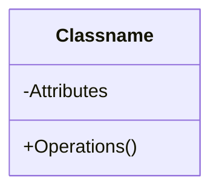
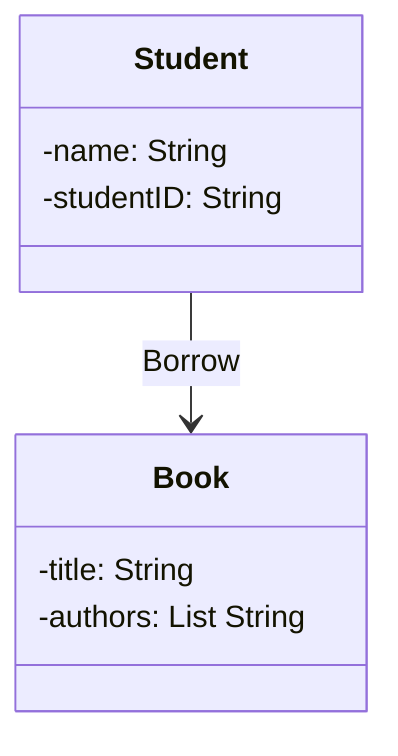

---
tags:
  - course/se
  - se/use-case
  - se/diagram
  - exam/mcq
  - exam/drawing
  - Done-by-me
---

# Include vs Extend vs  inheritance/generalization [[10 Include vs Extend]]

Include:  A (Base case) ---include---> B    必做的公共步骤。`include` 表示“每次执行 A，都一定会执行 B”。B 通常是多个 use case 共享的公共子流程。

Extend:  A (Base use case) <---extend--- B 条件触发的可选行为。Extension use case happens only under some condition.

Ineritance: A（父） <------B（子） 
A is the generalization of B.
B is a specialization of A.
B is a kind of A.
For two use cases A and B, if A the generalization of B, and B is a specialization of A, then they have inheritance relationships.
子 use case 是父 use case 的一种特殊类型。

![[use-case-diagram-relationships.png]]

# State Machine Model
![[state-transition-machine.png.png]]

Data-Flow Model
![[notation.png.png]]

# Features of A Class
## Abstraction 抽象
抽象就是只保留当前问题里重要的属性和行为，忽略不重要的细节。
Class: File
Attributes: size
Operations: open, close, edit
我们关心的是文件的大小、打开、关闭、编辑。
但不关心它在硬盘上具体怎么存、底层二进制怎么组织。
特点：
- Reduce the affection（影响）of the changes 
- Facilitate （使容易 ）component reuse 
- Simplify （简化） the interfaces.
## Encapsulation 封装
封装就是把数据和操作包在类里面，外部对象不需要知道内部怎么实现，只需要知道怎么使用。

## Inheritance 继承
子类继承父类已有的属性和操作，同时可以增加或特殊化自己的内容。
Word file（Sub-class) <|-- File （Super-class）
一个子类可以有两个父类
## Polymorphic 多态
多态就是同一个操作名，可以根据对象或参数不同，表现出不同实现。
insert(IMAGE oImage)
insert(char *text)
add(int i1, int i2)
add(char *str1, char *str2)

# Object-Oriented
Object + Classification + Inheritance + Communication

# Object-Oriented Software Development
Develop the software which is a collection of objects that incorporate both data structure （数据）and behavior （行为）
## 四个阶段：
- Object-Oriented Analysis (Requirements specification) 
- Object-Oriented Design (Architectural Design)
- Object Design (Detailed Design)
- Object-Oriented Programming (Implementation)

# UML
![[uml.png.png]]

## Class Diagram

### \<\<instacance of \>\>
object ---\<\<instanceOf\>\> ---\> class

### Class Notation

### Associations and links
A link （链接）is – a connection between two objects

An association 
– a relationship between classes and represents a group of links 
– bidirectional （双向）or unidirectional （单向）

Example:

Unidirectional: A student can query the books he/she borrowed but it is not possible to find which student is this book lent to
