---
tags:
  - course/se
  - se/use-case
  - se/diagram
  - exam/mcq
  - exam/drawing
  - Done-by-me
---


# My SE Notes

## Sources / Related Notes

Main source folder:

- [[SE Source Index]]

Lecture sources:

- Lecture 4 System Models: [PDF](<file:///D:/study/se/Lecture%204%20System%20models.pdf>) / [TXT](<file:///D:/study/se/Lecture%204%20System%20models.txt>)
- Lecture 5 OO Object / Classes: [PDF](<file:///D:/study/se/Lecture%205%20-%20OO%20object.pdf>) / [TXT](<file:///D:/study/se/Lecture%205%20-%20OO%20object.txt>)
- Lecture 6 OOA / UML introduction: [PDF](<file:///D:/study/se/Lecture%206%20-%20OOA%20%20UML%20introduction.pdf>) / [TXT](<file:///D:/study/se/Lecture%206%20-%20OOA%20%20UML%20introduction.txt>)

Class exercise sources:

- Lecture 4 use case diagram PPT: [PPTX](<file:///D:/study/se/class%20exercise%20lecture%204%20use%20case%20diagram.pptx>)
- Lecture 4 state transition diagram PPT: [PPTX](<file:///D:/study/se/class%20exercise%20lecture%204%20state%20transition%20diagram.pptx>)
- Lecture 5 class diagram PPT: [PPTX](<file:///D:/study/se/Class%20exercise%20lecture%205%20Class.pptx>)
- Lecture 6 class diagram PPT: [PPTX](<file:///D:/study/se/class%20exercise%20lecture%206%20class%20diagram.pptx>)

Detailed notes:

- [[10 Include vs Extend]]
- [[11 Use Case Diagram Relationships]]
- [[01 Diagram Questions Drawing Guide]]
- [[04 Class Exercise Templates]]
- [[09 All PPT Explanations]]

---

# Include vs Extend vs inheritance/generalization

Source:

- [[10 Include vs Extend]]
- [[11 Use Case Diagram Relationships]]
- Image: [[use-case-diagram-relationships.png]]

Include:  A (Base case) ---include---> B    必做的公共步骤。`include` 表示“每次执行 A，都一定会执行 B”。B 通常是多个 use case 共享的公共子流程。

Extend:  A (Base use case) <---extend--- B 条件触发的可选行为。Extension use case happens only under some condition.

Ineritance: A（父） <------B（子） 
A is the generalization of B.
B is a specialization of A.
B is a kind of A.
For two use cases A and B, if A the generalization of B, and B is a specialization of A, then they have inheritance relationships.
子 use case 是父 use case 的一种特殊类型。

![[use-case-diagram-relationships.png]]


# State Machine Model

Source:

- Lecture 4 System Models: [PDF](<file:///D:/study/se/Lecture%204%20System%20models.pdf>)
- Class exercise: [state transition diagram PPTX](<file:///D:/study/se/class%20exercise%20lecture%204%20state%20transition%20diagram.pptx>)
- Image: [[state-transition-machine.png.png]]

![[state-transition-machine.png.png]]

Data-Flow Model

Source:

- Lecture 4 System Models: [PDF](<file:///D:/study/se/Lecture%204%20System%20models.pdf>)
- Image: [[notation.png.png]]

![[notation.png.png]]

# Features of A Class

Source:

- Lecture 5 OO Object / Classes: [PDF](<file:///D:/study/se/Lecture%205%20-%20OO%20object.pdf>) / [TXT](<file:///D:/study/se/Lecture%205%20-%20OO%20object.txt>)
- Related: [[05 Lecture Review Checklists]]

## Abstraction 抽象
抽象就是只保留当前问题里重要的属性和行为，忽略不重要的细节。
Class: File
Attributes: size
Operations: open, close, edit
我们关心的是文件的大小、打开、关闭、编辑。
但不关心它在硬盘上具体怎么存、底层二进制怎么组织。
特点：
- Reduce the affection（影响）of the changes 
- Facilitate （使容易 ）component reuse 
- Simplify （简化） the interfaces.
## Encapsulation 封装
封装就是把数据和操作包在类里面，外部对象不需要知道内部怎么实现，只需要知道怎么使用。

## Inheritance 继承
子类继承父类已有的属性和操作，同时可以增加或特殊化自己的内容。
Word file（Sub-class) <|-- File （Super-class）
一个子类可以有两个父类
## Polymorphic 多态
多态就是同一个操作名，可以根据对象或参数不同，表现出不同实现。
insert(IMAGE oImage)
insert(char *text)
add(int i1, int i2)
add(char *str1, char *str2)

# Object-Oriented
Object + Classification + Inheritance + Communication

# Object-Oriented Software Development

Source:

- Lecture 6 OOA / UML introduction: [PDF](<file:///D:/study/se/Lecture%206%20-%20OOA%20%20UML%20introduction.pdf>) / [TXT](<file:///D:/study/se/Lecture%206%20-%20OOA%20%20UML%20introduction.txt>)

Develop the software which is a collection of objects that incorporate both data structure （数据）and behavior （行为）
## 四个阶段：
- Object-Oriented Analysis (Requirements specification) 
- Object-Oriented Design (Architectural Design)
- Object Design (Detailed Design)
- Object-Oriented Programming (Implementation)

# UML

Source:

- Lecture 6 OOA / UML introduction: [PDF](<file:///D:/study/se/Lecture%206%20-%20OOA%20%20UML%20introduction.pdf>)
- Image: [[uml.png.png]]

![[uml.png.png]]

## Class Diagram

### \<\<instacance of \>\>
object ---\<\<instanceOf\>\> ---\> class

### Class Notation
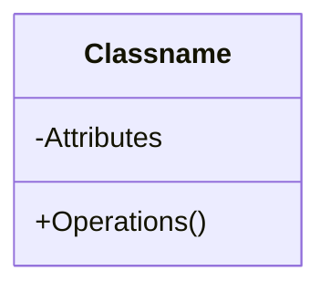

### Associations and links

Source:

- Lecture 6 OOA / UML introduction: [PDF](<file:///D:/study/se/Lecture%206%20-%20OOA%20%20UML%20introduction.pdf>)
- Lecture 6 class diagram exercise: [PPTX](<file:///D:/study/se/class%20exercise%20lecture%206%20class%20diagram.pptx>)

A link （链接）is – a connection between two objects

An association 
– a relationship between classes and represents a group of links 
– bidirectional （双向）or unidirectional （单向）

Example:
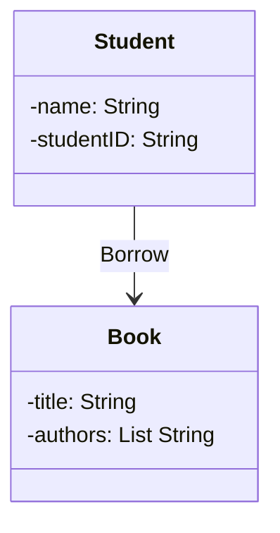

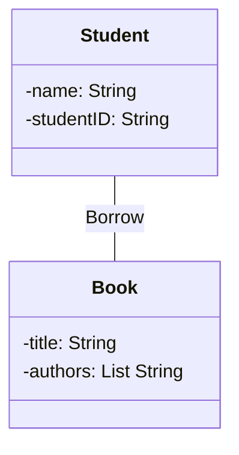

Unidirectional: A student can query the books he/she borrowed but it is not possible to find which student is this book lent to

Associations are inherently bidirectional.
Bidirectional A student can query the books he/she borrowed and It is possible to find which student is this book lent to


![[asspcoatopm-classes.png.png]]

Source:

- Image: [[asspcoatopm-classes.png.png]]
- Related: association class explanation from class diagram lecture/exercise.

关联关系本身可以有属性和操作。
关联类不能脱离它连接的类单独存在。
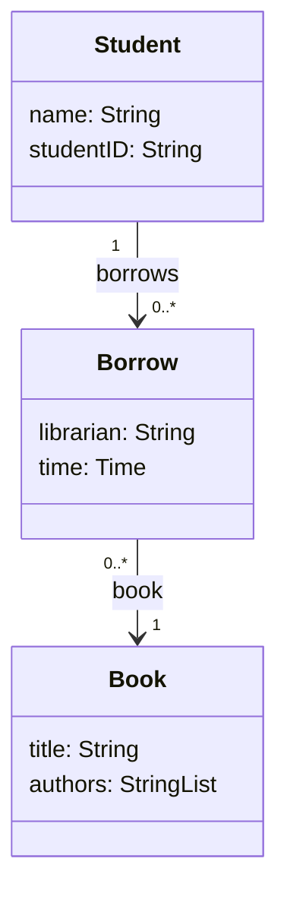
### Multiplicity

Source:

- Lecture 6 OOA / UML introduction: [PDF](<file:///D:/study/se/Lecture%206%20-%20OOA%20%20UML%20introduction.pdf>)

**常见 multiplicity**

1 exactly one / 正好一个 
0..1 zero or one / 零个或一个 
0..* zero or many / 零个或多个 
1..* one or many / 一个或多个 
\* many / 多个 
\* n exactly n / 正好 n 个
\* m..n from m to n / m 到 n 个

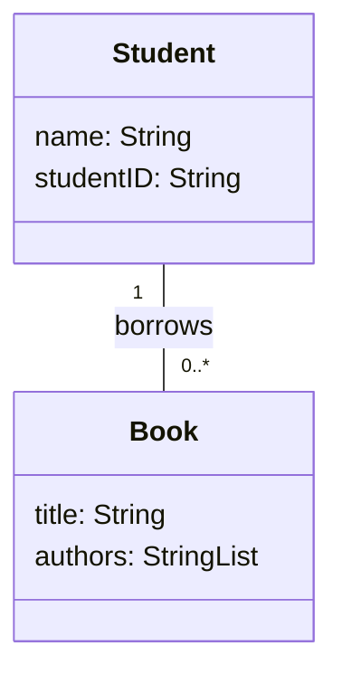
One student can borrow 0 or many books

### Qualifier

Source:

- Image: [[qualifier.png.png]]

![[qualifier.png.png]]

### Inheritance vs Aggregation

Source:

- Lecture 5 OO Object / Classes: [PDF](<file:///D:/study/se/Lecture%205%20-%20OO%20object.pdf>)
- Lecture 6 UML relationships: [PDF](<file:///D:/study/se/Lecture%206%20-%20OOA%20%20UML%20introduction.pdf>)

Inheritance: **is-a** relationship / 是一种

Aggregation: **has-a / part-of** relationship / 拥有、包含、整体-部分

### Inheritance 继承

B（子类 / subclass） is a kind of A（父类 / superclass）.

```text
B --|> A
子类 --|> 父类
```

Example:

```text
Dog is an Animal.
PPT file is a File.
Word file is a File.
```

Mermaid:

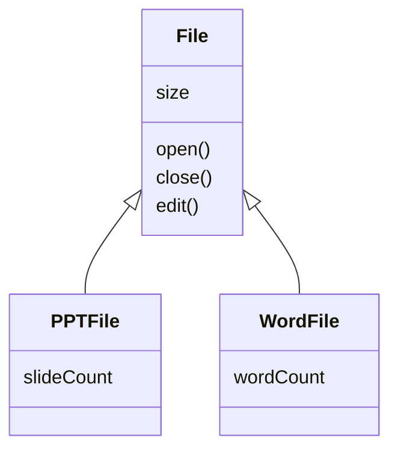

Meaning:

- `PPTFile` inherits attributes and operations from `File`.
- `WordFile` inherits attributes and operations from `File`.
- The hollow triangle arrow points to superclass.

中文理解：

继承表示“子类是父类的一种”。  
子类可以复用父类已有的 attributes 和 operations，并且可以增加自己的特殊 features。

### Aggregation 聚合

A has B, but B can still exist without A.

```text
A o-- B
整体 o-- 部分
```

Example:

```text
Team has Players.
Library has Books.
Department has Teachers.
```

Mermaid:

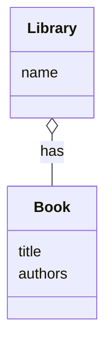

Meaning:

- `Library` has `Book`.
- But `Book` can still exist if this library is deleted or if the book moves to another library.
- Empty diamond is on the whole side.

中文理解：

聚合表示“整体-部分”关系，但这个部分不是强依赖。  
部分对象可以脱离整体继续存在。

## Difference

| Relationship | Question to ask | Meaning | Mermaid / UML |
|---|---|---|---|
| Inheritance | Is B a kind of A? | B 是 A 的一种 | `A <|-- B` |
| Aggregation | Does A have B? | A 拥有/包含 B | `A o-- B` |
| Composition | Is B a part of A and cannot exist independently? | B 是 A 的强组成部分 | `A *-- B` |


### Aggregation vs Composition

Aggregation is weak whole-part:

```text
Library o-- Book
```

Composition is strong whole-part:

```text
House *-- Room
```

Composition means the part strongly depends on the whole.

中文：

- Aggregation: 部分可以独立存在。
- Composition: 部分通常不能脱离整体独立存在。

## Composition 组合

A owns B strongly. If A is destroyed, B usually cannot exist independently.

```text
A *-- B
整体 *-- 部分
```

Example:

```text
House has Rooms.
Order has OrderItems.
HumanBody has Heart.
```

Mermaid:

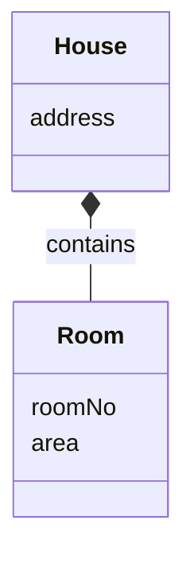

Meaning:

- `House` is the whole.
- `Room` is a part of `House`.
- If the house does not exist, the room as part of that house does not exist.
- Filled diamond is on the whole side.

中文理解：

组合也是“整体-部分”，但是比 aggregation 更强。  
部分对象强依赖整体对象，生命周期通常和整体绑定。

## Aggregation vs Composition Example

Aggregation:

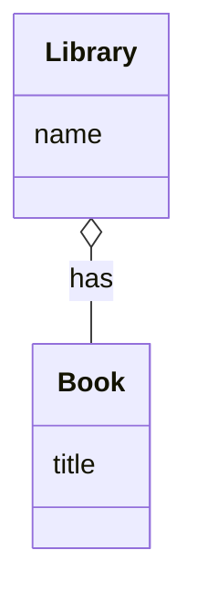

中文：

Library has Books, but Book can still exist without this Library.

Composition:

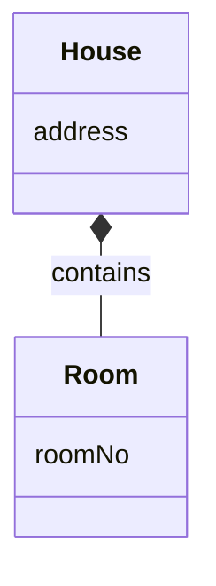

中文：

House has Rooms, and Room normally cannot exist independently without the House.

### Quick Memory

```text
Inheritance = is-a
Aggregation = has-a, weak ownership
Composition = part-of, strong ownership
```

Exam trap:

```text
Library o-- Book      correct for aggregation
House *-- Room        correct for composition
Book <|-- Library     wrong, because Library is not a kind of Book
```

## Operation

![[operations-in-a-class.png]]

Source:

- Image: [[operations-in-a-class.png]]
- Lecture 5 OO Object / Classes: [PDF](<file:///D:/study/se/Lecture%205%20-%20OO%20object.pdf>)
- Related concept: class operations should work on attributes of the same class.

Operation in a class must work on the attributes of this class.

中文：

一个 class 里面的 operation，应该主要操作这个 class 自己的 attributes。  
不要因为“某个 user 做了这个动作”，就把 operation 放到 User 里面。

## Where should an operation belong?

Rule:

```text
Operation belongs to the class whose attributes it works on.
操作谁的数据，就放到谁的类里。
```

Example 1:

```text
User can edit Document.
Edit() belongs to Document, not User.
```

Why:

```text
Edit() changes Document.Content.
```

Mermaid:

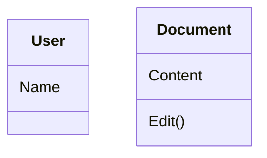

中文理解：

User 只是触发 edit 的 actor/object。  
真正被修改的是 Document 的 Content，所以 `Edit()` 应该放在 `Document`。

Example 2:

```text
User can draw a Line.
Draw() belongs to Line, not User.
```

Why:

```text
Draw() works on Line.Point1 and Line.Point2.
```

Mermaid:

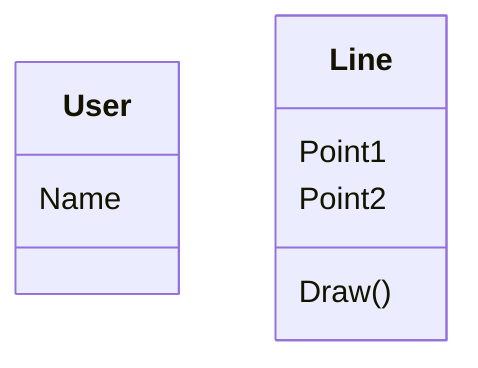

中文理解：

User 发出 draw 的命令，但 Line 根据自己的两个点来画线。  
所以 `Draw()` 属于 `Line`。

## Association between Classes

![[association-between-classes.png]]

Source:

- Image: [[association-between-classes.png]]
- Lecture 5 / class modeling slides.
- Related section: [[#Operation]]

Association between classes is created because two participating classes have information dependency.

中文：

两个 class 之间是否需要 association，不是看句子里有没有 verb，而是看它们之间有没有信息依赖 / 静态关系。

Important sentence:

```text
Not every verb is an association.
Only when two classes have some static relationship, there is an association.
```

中文：

不是每个动词都是 association。  
只有两个类之间需要保存某种状态关系 / 信息依赖时，才需要 association。

## Is Edit an association?

Question:

```text
If a user can edit the document, is edit an association?
```

Answer:

It depends on whether user information needs to be recorded.

Case 1:

```text
If the edit work needs to be tracked according to user's information,
then edit is an association.
```

中文：

如果系统需要记录“哪个 user 编辑了哪个 document”，那么 User 和 Document 之间有信息依赖，需要 association。

Mermaid:

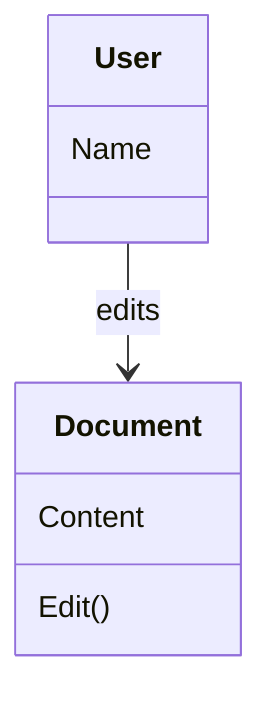

Case 2:

```text
If the edit work will not record any user information,
the association is not needed.
```

中文：

如果系统只需要修改 Document.Content，不需要记录 user 信息，那么 User 和 Document 不一定需要 association。

## Operation vs Association

| Question | Look at | Result |
|---|---|---|
| Where does `Edit()` belong? | Which class's attributes are changed? | `Document`, because it changes `Content` |
| Is `edit` an association? | Do we need to remember relationship/info between User and Document? | only if user edit info must be tracked |

## Quick Memory

```text
Operation = behavior inside a class, working on its own attributes.
Association = static information dependency between classes.
```

中文口诀：

```text
操作谁的数据，operation 放谁那里。
需要记住谁和谁的关系，才画 association。
有动词不一定有关联。
```

Exam trap:

```text
User edits Document
```

Do not automatically put `Edit()` in `User`.  
Do not automatically draw `User -- Document`.

Ask:

1. Does `Edit()` change `Document.Content`?
   - Yes -> `Edit()` belongs to `Document`.
2. Do we need to record which `User` edited which `Document`?
   - Yes -> draw association.
   - No -> association is not needed.

# OOA simplified iSpace system
