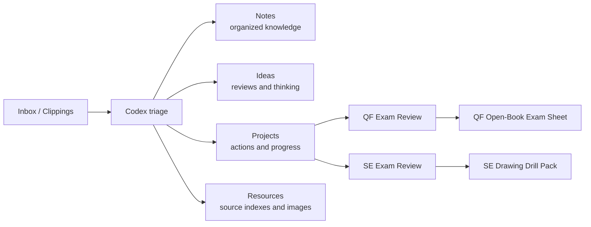

<h1 align="center">Second Brain</h1>

<p align="center">
  <strong>Your mirrored mind, externalized.</strong><br>
  An Obsidian vault for exam sprinting, private thinking, source indexing, and Codex-assisted reflection.
</p>

<p align="center">
  <a href="AGENTS.md"></a>
  <a href="Projects/QF%20Exam%20Review.md"></a>
  <a href="Projects/SE%20Exam%20Review.md"></a>
  <a href="Resources/Vault%20Management/Vault%20Relationship%20Map.md"></a>
</p>

<p align="center">
  
</p>

---

## What This Is

This vault is not just a place to store notes. It is a working second brain for 蔡杰超:

- to turn Software Engineering review into fast diagram recall and MCQ concept boundaries;
- to compress Quantum Finance into one A4 open-book exam sheet;
- to preserve private thoughts, weekly reviews, project decisions, and long-term learning traces;
- to let Codex read the vault structure, connect notes, and suggest the next highest-leverage action.

The current operating mode is **exam sprint first**. A beautiful vault is nice; a vault that helps answer questions under time pressure is better.

## Current Sprint

| Track | Current state | Next pressure point |
|---|---|---|
| Quantum Finance | CH1-3 summarized; Course Revision imported; open-book sheet started | CH4-5 QFSE / QPL / FDM / Cardano / calculation chain |
| Software Engineering | Notes, maps, drill pack, MCQ traps, class exercise explanations are already mature | Timed drawing recall and concept-boundary practice |
| Vault System | AGENTS, tag guide, usage guide, relationship map, source indexes exist | Keep finished notes read-only; update projects and reviews instead |

## Start Here

- [AGENTS.md](AGENTS.md): identity, current goals, Codex rules, sprint priorities.
- [Vault Relationship Map](Resources/Vault%20Management/Vault%20Relationship%20Map.md): the graph of how this vault fits together.
- [Interactive Vault Graph](Resources/Vault%20Management/Interactive%20Vault%20Graph.html): a local draggable graph view generated from Markdown links and YAML tags.
- [Obsidian Codex Usage Guide](Resources/Vault%20Management/Obsidian%20Codex%20Usage%20Guide.md): how Inbox, Notes, Ideas, Projects, and Resources should be used.
- [2026-06-01 Brain Review](Ideas/Weekly%20Reviews/2026-06-01%20Brain%20Review.md): latest full-vault review and next actions.

## Exam Navigation

### Quantum Finance

- [QF Exam Review](Projects/QF%20Exam%20Review.md): project tracker and immediate next actions.
- [QF Course Map](Notes/Courses/Quantum%20Finance/QF%20Course%20Map.md): chapter coverage control page.
- [Exam Focus](Notes/Courses/Quantum%20Finance/Exam%20Focus.md): teacher-confirmed revision scope.
- [Quantum Finance Notes](Notes/Courses/Quantum%20Finance/Quantum%20Finance%20Notes.md): Chinese understanding and chapter logic.
- [QF Open-Book Exam Sheet](Notes/Courses/Quantum%20Finance/QF%20Open-Book%20Exam%20Sheet.md): English formulas, templates, and A4 candidates.
- [QF Source Index](Resources/Quantum%20Finance/QF%20Source%20Index.md): original PDF source links.

### Software Engineering

- [SE Exam Review](Projects/SE%20Exam%20Review.md): project tracker and practice route.
- [00 SE Exam Map](Notes/Courses/Software%20Engineering/00%20SE%20Exam%20Map.md): control page for the course.
- [01 Diagram Questions Drawing Guide](Notes/Courses/Software%20Engineering/01%20Diagram%20Questions%20Drawing%20Guide.md): repeatable drawing steps.
- [07 Final Cram Sheet](Notes/Courses/Software%20Engineering/07%20Final%20Cram%20Sheet.md): last-day concept sheet.
- [08 Drawing Drill Pack](Notes/Courses/Software%20Engineering/08%20Drawing%20Drill%20Pack.md): active recall practice.
- [SE Source Index](Resources/Software%20Engineering/SE%20Source%20Index.md): original lecture and exercise source links.

## Vault Flow



## Operating Rules

1. Finished course notes are read-only by default. Improve them only when explicitly requested.
2. During exam sprint, prefer outputs that can be written, drawn, calculated, or searched quickly.
3. Use folders for stable location, links for conceptual relationships, and tags for filtering.
4. Large external resources stay outside the vault when possible; source indexes keep them reachable.
5. Every Codex session should end with a smallest useful next action.

## Folder Map

```text
Inbox/       raw captures and temporary material
Notes/       organized course notes and learning material
Ideas/       reviews, original thinking, cognitive changes
Projects/    active trackers and next actions
Resources/   source indexes, images, vault-management assets
AGENTS.md    Codex-facing operating instructions
```

## Codex Prompts

Use these prompts when working inside this vault:

```text
Only use my local vault. What is the highest-leverage next action for QF today?
```

```text
Check my SE practice route. Which two diagrams should I redraw from memory first?
```

```text
Review today's changes and write one cognitive conflict, one missing link, and one next action.
```

## Visual Identity

The cover image represents the core idea of this vault:

> the person outside the mirror is the current self; the reflections inside the mirror are memory, knowledge, insight, and the sharper second-brain self.

Asset path:

```text
Resources/Vault Management/Images/second-brain-cover.png
```

---

<p align="center">
  <strong>Build less decoration. Preserve more thinking. Retrieve under pressure.</strong>
</p>
