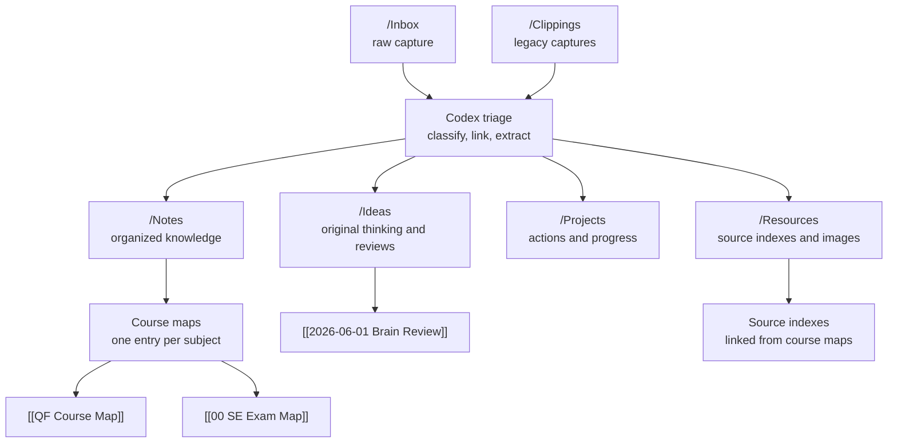
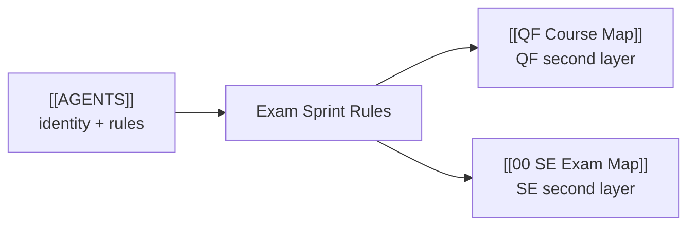
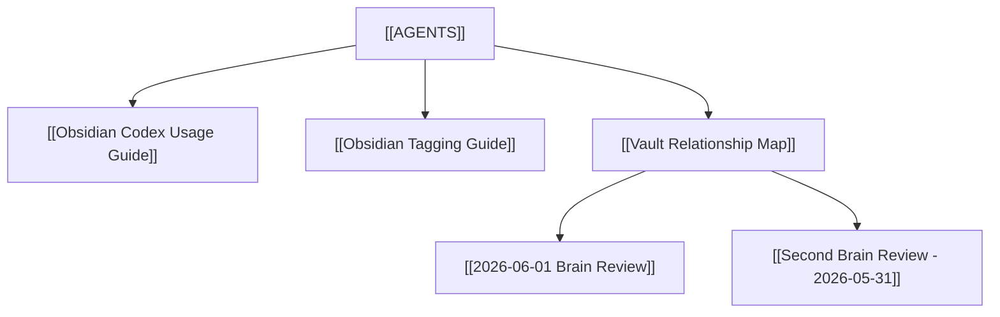

---
tags:
  - vault/management
  - obsidian/graph
  - obsidian/workflow
  - codex/second-brain
---

# Vault Relationship Map

This is the human-readable relationship map for the vault. Use it as the first stop when deciding where a note belongs or which page to open next.

## Clickable Link Index

Core control pages:

- [[AGENTS]]
- [[Obsidian Codex Usage Guide]]
- [[Obsidian Tagging Guide]]
- [[2026-06-01 Brain Review]]
- [[Second Brain Review - 2026-05-31]]

Course maps:

- [[QF Course Map]]
- [[00 SE Exam Map]]

## Main Flow

## Exam Sprint Map

## Course Layer Rule

- QF details live under [[QF Course Map]].
- SE details live under [[00 SE Exam Map]].
- This page should keep only one direct course connection per subject, so the vault-level graph stays readable.

## Management Relationships

## Navigation Rules

- Start from [[AGENTS]] when you need the current operating rules.
- Start from [[QF Course Map]] when studying Quantum Finance.
- Start from [[00 SE Exam Map]] when studying Software Engineering.
- Start from [[2026-06-01 Brain Review]] when deciding the next highest-leverage action.
