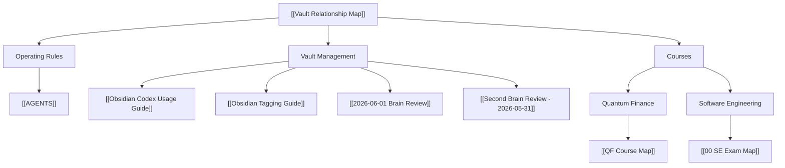

---
tags:
  - vault/management
  - obsidian/graph
  - obsidian/workflow
  - codex/second-brain
---

# Vault Relationship Map

This is the human-readable relationship tree for the vault. Use it as the first stop when deciding where a note belongs or which page to open next.

## Tree Index

```text
Vault Relationship Map
├── Operating Rules
│   └── AGENTS
├── Vault Management
│   ├── Obsidian Codex Usage Guide
│   ├── Obsidian Tagging Guide
│   ├── 2026-06-01 Brain Review
│   └── Second Brain Review - 2026-05-31
└── Courses
    ├── Quantum Finance
    │   └── QF Course Map
    └── Software Engineering
        └── 00 SE Exam Map
```

## Clickable Links

Operating rules:

- [[AGENTS]]

Vault management:

- [[Obsidian Codex Usage Guide]]
- [[Obsidian Tagging Guide]]
- [[2026-06-01 Brain Review]]
- [[Second Brain Review - 2026-05-31]]

Course roots:

- [[QF Course Map]]
- [[00 SE Exam Map]]

## Vault Tree



## Storage Tree

```text
/Inbox      -> raw capture, then triage
/Notes      -> organized course and concept notes
/Ideas      -> original thinking and reviews
/Projects   -> active project progress pages
/Resources  -> source indexes, images, external files
/Clippings  -> legacy web captures
```

## Course Layer Rule

- QF details live under [[QF Course Map]].
- SE details live under [[00 SE Exam Map]].
- Keep only one direct course root per subject on this page.
- Do not list every SE/QF detail page here; let the subject map own its children.

## Navigation Rules

- Start from [[AGENTS]] when you need the current operating rules.
- Start from [[Vault Relationship Map]] when deciding where to go.
- From there, open [[QF Course Map]] for Quantum Finance or [[00 SE Exam Map]] for Software Engineering.
- Start from [[2026-06-01 Brain Review]] when deciding the next highest-leverage action.
