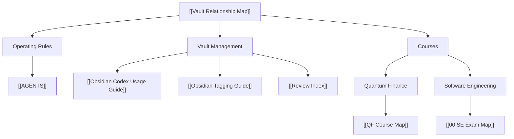

---
tags:
  - vault/management
  - obsidian/graph
  - obsidian/workflow
  - codex/second-brain
---

# Vault Relationship Map

This is the human-readable relationship tree for the vault. Use it as the first stop when deciding where a note belongs or which page to open next.

## Tree Index

```text
Vault Relationship Map
├── Operating Rules
│   └── AGENTS
├── Vault Management
│   ├── Obsidian Codex Usage Guide
│   ├── Obsidian Tagging Guide
│   └── Review Index
└── Courses
    ├── Quantum Finance
    │   └── QF Course Map
    └── Software Engineering
        └── 00 SE Exam Map
```

## Clickable Links

Operating rules:

- [AGENTS](../../AGENTS.md)

Vault management:

- [Interactive Vault Graph](./Interactive%20Vault%20Graph.md)
- [Obsidian Codex Usage Guide](./Obsidian%20Codex%20Usage%20Guide.md)
- [Obsidian Tagging Guide](./Obsidian%20Tagging%20Guide.md)
- [Review Index](../../Ideas/Review%20Index.md)

Course roots:

- [QF Course Map](../../Notes/Courses/Quantum%20Finance/QF%20Course%20Map.md)
- [00 SE Exam Map](../../Notes/Courses/Software%20Engineering/00%20SE%20Exam%20Map.md)

## Vault Tree



## Storage Tree

```text
/Inbox      -> raw capture, then triage
/Notes      -> organized course and concept notes
/Ideas      -> original thinking and reviews
/Projects   -> active project progress pages
/Resources  -> source indexes, images, external files
/Clippings  -> legacy web captures
```

## Course Layer Rule

- QF details live under [QF Course Map](../../Notes/Courses/Quantum%20Finance/QF%20Course%20Map.md).
- SE details live under [00 SE Exam Map](../../Notes/Courses/Software%20Engineering/00%20SE%20Exam%20Map.md).
- Keep only one direct course root per subject on this page.
- Do not list every SE/QF detail page here; let the subject map own its children.
- Review notes are listed in [Review Index](../../Ideas/Review%20Index.md) as plain text. Keep only the review index as the tree node here.

## Navigation Rules

- Start from [AGENTS](../../AGENTS.md) when you need the current operating rules.
- Start from [Vault Relationship Map](./Vault%20Relationship%20Map.md) when deciding where to go.
- Open [Interactive Vault Graph](./Interactive%20Vault%20Graph.md) when you want a draggable graph-style view.
- From there, open [QF Course Map](../../Notes/Courses/Quantum%20Finance/QF%20Course%20Map.md) for Quantum Finance or [00 SE Exam Map](../../Notes/Courses/Software%20Engineering/00%20SE%20Exam%20Map.md) for Software Engineering.
- Use [Review Index](../../Ideas/Review%20Index.md) when deciding the next highest-leverage action from past reviews.
